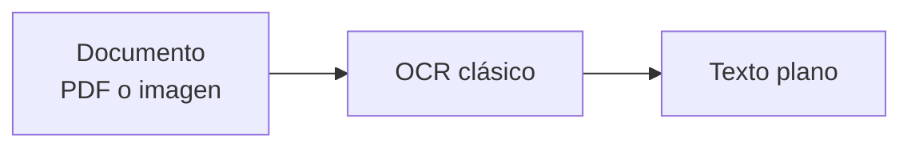
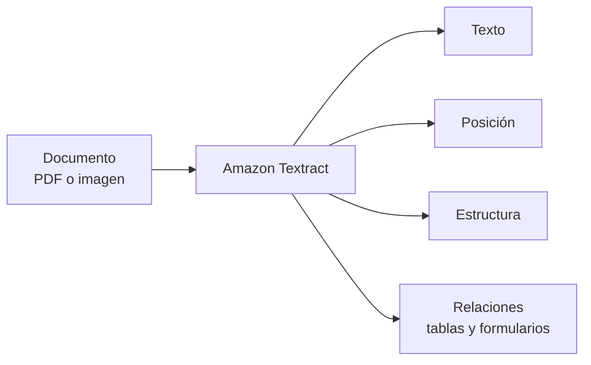
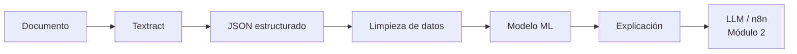
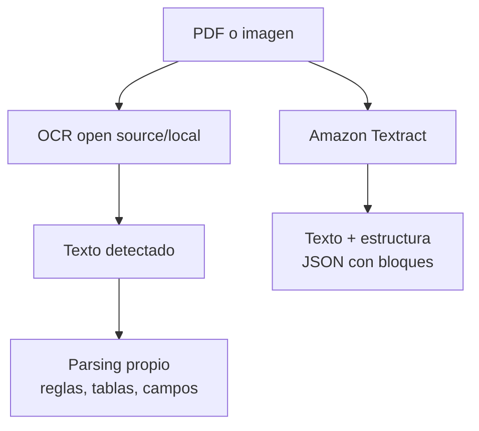

# Clase 1: Introducción a AWS Textract y configuración del entorno

| | |
|---|---|
| **Clase** | 1 de 11 |
| **Duración** | 3 horas |
| **Controlador** | `Clase01Controller` |
| **Endpoints** | `GET /modulo1/clase01/test` (auth), `POST /modulo1/clase01/textract/text` |

## Objetivos

Al terminar esta sesión podrás:

- Explicar qué hace Textract y para qué sirve en un banco.
- Tener tu API NestJS conectada a AWS.
- Extraer texto de un documento simple en S3 y devolverlo por HTTP.
- Guardar el texto extraído en Postgres para usarlo en las siguientes clases.
- Proteger la API con **API key** y **API secret** (cabeceras HTTP) antes de llamar a Textract.

---

## Parte teórica

### Antes de empezar: OCR, Textract y LLMs

Antes de escribir código, ubica qué tipo de inteligencia usaremos en esta clase:







| Tecnología | Idea clave | En este curso |
|------------|------------|---------------|
| OCR clásico | Convierte imagen en texto | Punto de comparación |
| Textract | Extrae texto, posición y estructura del documento | Base del Módulo 1 |
| LLM | Interpreta, resume y conversa sobre información | Se integra en el Módulo 2 |

**Concepto importante:** Textract convierte documentos en datos. Un LLM convierte datos o texto en conversación, explicación o asistencia.

**Por eso no empezamos con LLMs:** primero necesitamos datos trazables, validados y conectados a un flujo de crédito. Luego esos datos podrán ser usados por agentes, chats y automatizaciones.

### Textract vs OCR open source/local



| Capacidad | OCR open source/local | Amazon Textract |
|-----------|------------------------|-----------------|
| Lectura de texto | Sí | Sí |
| Control de infraestructura | Alto | Bajo, servicio administrado |
| Instalación y mantenimiento | A cargo del equipo | A cargo de AWS |
| Formularios y tablas | Requiere lógica adicional | Funcionalidad incluida |
| Escalabilidad | Depende del servidor propio | Gestionada por AWS |
| Integración con S3/AWS | Hay que construirla | Nativa |
| Costo | Servidor propio + mantenimiento | Pago por uso |
| Trazabilidad | Depende de cómo se implemente | Bloques, coordenadas y confianza |

**Idea clave:** un OCR local puede ser suficiente para texto simple. Textract es más útil cuando necesitamos estructura documental, trazabilidad e integración con un flujo en AWS.

### ¿Qué problema resolvemos?

En evaluación crediticia recibes **documentos** (PDF, fotos): solicitudes, carnets, estados de cuenta. Alguien tiene que leerlos y pasar los datos al sistema. Eso es lento y propenso a errores.

**Amazon Textract** es un servicio que **lee documentos por ti** y devuelve texto y estructura (líneas, formularios, tablas) sin que montes tu propio motor OCR desde cero.

### Refuerzo: qué aporta Textract

Piensa en OCR como **leer letras** y en Textract como **leer letras dentro de un documento con estructura**.  
Aunque Textract entregue más contexto, el equipo todavía debe validar, limpiar y guardar esos datos correctamente.

### Familia de operaciones (visión general)

En este curso usarás varias “recetas” de Textract. Hoy empiezas por la más simple:

| Operación | En una frase | Cuándo la verás |
|-----------|--------------|------------------|
| `DetectDocumentText` | “Dame todo el texto” | **Hoy** |
| `AnalyzeDocument` (FORMS / TABLES) | Formularios y tablas | Clase 2 |
| `AnalyzeID` | Carnet / pasaporte | Clase 2 |
| `AnalyzeExpense` | Recibos y colillas | Clase 2 |
| Queries | Preguntas en lenguaje natural al documento | Clase 3 |

### Documentos típicos en banca

- Solicitud de crédito (formulario).
- Documento de identidad.
- Estado de cuenta y colilla de pago.
- Contratos y certificados (más adelante con Queries).

### Costos (idea general)

Textract cobra **por página procesada** y el precio cambia según la API usada.

| API / uso | Idea de costo |
|-----------|---------------|
| `DetectDocumentText` | Es la opción base para extraer texto. En ejemplos oficiales, AWS muestra `USD 0.0015` por página para el primer millón de páginas en `US West (Oregon)`. |
| `AnalyzeDocument` | Sube el costo cuando se extraen estructuras como formularios, tablas o queries. |
| `AnalyzeExpense` / `AnalyzeID` | Tienen precios propios por página/documento analizado. |
| Free Tier | AWS ofrece una capa gratuita inicial para nuevos clientes, con límites mensuales por API durante los primeros meses. |

Para el laboratorio:

- Usa documentos pequeños.
- Reutiliza archivos de prueba.
- Evita reprocesar en bucle mientras desarrollas.
- Revisa siempre el precio actualizado antes de procesar volumen real.

Referencias oficiales:

- [Qué es Amazon Textract](https://docs.aws.amazon.com/textract/latest/dg/what-is.html)
- [Precios de Amazon Textract](https://aws.amazon.com/textract/pricing/)

### NestJS en este curso

Tu API seguirá una estructura clara:

```
Petición HTTP → Controller → Service → AWS Textract / TypeORM → Postgres
```

- **Controller**: recibe la petición y devuelve la respuesta.
- **Service**: lógica de negocio, llamadas a AWS y acceso a Postgres con `@InjectRepository`.
- **Módulo**: agrupa controllers y services por tema (`Modulo1Module`, etc.).

Hoy creas el primer eslabón de esa cadena.

---

## Parte práctica

Trabaja en tu repo **esqueleto** (local o en Render).

### 0. Autenticación con API key y secret (obligatorio primero)

Antes de Textract, deja la API lista con Postgres, migraciones, seed y el endpoint de prueba autenticado.

**Guía paso a paso (código, variables, migraciones y seed):** [setup-inicial.md](./setup-inicial.md)

Resumen rápido:

```bash
npm install
cp .env.example .env
npm run migration:run
npm run seed:api-client
# Crear AuthModule, ApiKeyGuard, Clase01Controller (ver guía)
npm run start:dev
curl -H "x-api-key: test1" -H "x-api-secret: pass1" http://localhost:3000/modulo1/clase01/test
```

No continúes con S3/Textract hasta obtener `endpoint test autenticado` en ese `curl`.

### 1. Sube documentos de prueba a S3

Para esta primera clase usa documentos sencillos, preferiblemente de una página:

- certificado de trabajo;
- boleta de pago;
- solicitud simple de crédito;
- extracto de cuenta corto.

Sube 2 o 3 archivos a **tu bucket S3 asignado** (en la raíz del bucket, sin carpetas). Ejemplo:

**Formatos admitidos por Textract:** PDF, PNG, JPEG/JPG, TIFF. **No** uses WEBP, GIF, HEIC ni otros; Textract responde `UnsupportedDocumentException`.

```txt
s3://grupo1-980921750553-us-east-1-an/certificado-trabajo.pdf
s3://grupo1-980921750553-us-east-1-an/boleta-pago.jpg
```

En el endpoint enviaremos el **nombre del objeto en S3** (la clave dentro del bucket), por ejemplo:

```json
{
  "fileName": "certificado-trabajo.pdf"
}
```

### 2. Dependencias AWS y variables

El esqueleto ya incluye Nest, TypeORM, Postgres y scripts de migración/seed (ver [setup-inicial.md](./setup-inicial.md)). Añade solo el SDK de Textract:

```bash
npm install @aws-sdk/client-textract
```

1. En tu `.env`, completa además de `DATABASE_*` y `SEED_*`: región AWS, claves IAM y bucket S3.

```env
AWS_REGION=us-east-1
AWS_ACCESS_KEY_ID=
AWS_SECRET_ACCESS_KEY=
AWS_S3_BUCKET=
```

`AppModule` y `DatabaseModule` (TypeORM) ya vienen en el esqueleto; no uses el patrón antiguo con `DatabaseService` y `pg` directo.

### 3. Tabla para textos extraídos

Además de `api_clients` (migración del paso 0), crea la tabla donde guardarás el OCR:

```sql
CREATE TABLE IF NOT EXISTS raw_document_texts (
  id SERIAL PRIMARY KEY,
  file_name TEXT NOT NULL,
  s3_key TEXT NOT NULL,
  extracted_text TEXT NOT NULL,
  line_count INTEGER NOT NULL,
  created_at TIMESTAMP DEFAULT NOW()
);
```

(Ajusta el esquema si no es `public`: `CREATE TABLE tu_esquema.raw_document_texts ...`.)

#### Opción recomendada: crear una migración TypeORM para esta tabla

Desde la raíz del proyecto `esqueleto/`, puedes generar el **archivo base** de la migración con:

```bash
npx typeorm-ts-node-commonjs migration:create src/migrations/CreateRawDocumentTexts
```

Esto creará un archivo con nombre tipo `src/migrations/<timestamp>-CreateRawDocumentTexts.ts`.

Luego, abre ese archivo y define el SQL dentro del método `up()` (y el `DROP TABLE` en `down()`), siguiendo el formato de las migraciones existentes (clase que implementa `MigrationInterface`).

Finalmente, ejecuta las migraciones pendientes:

```bash
npm run migration:run
```

### 4. Crea los archivos de Textract

```txt
src/modulo1/clase01/clase01.service.ts
src/entities/raw-document-text.entity.ts
src/modulo1/clase01/textract.service.ts
```

`clase01.controller.ts` ya lo creaste en el paso de autenticación. En esta clase, el controller debe ser “fino”: el endpoint solo valida/recibe el body y **delegará la lógica** a un service.

Archivo: `src/modulo1/clase01/clase01.controller.ts`

```typescript
import { Body, Controller, Get, Post, UseGuards } from '@nestjs/common';
import { ApiKeyGuard } from '../../auth/guards/api-key.guard';
import { Clase01Service } from './clase01.service';

@Controller('modulo1/clase01')
@UseGuards(ApiKeyGuard) // protege TODO el controller (recomendado en el curso)
export class Clase01Controller {
  constructor(private readonly clase01: Clase01Service) {}

  @Get('test')
  testAuthenticated(): string {
    return 'endpoint test autenticado';
  }

  @Post('textract/text')
  async extractText(@Body() body: { fileName: string }) {
    return await this.clase01.extractText(body);
  }
}
```

Si prefieres proteger solo una ruta (en lugar de todo el controller), quita `@UseGuards(ApiKeyGuard)` del controller y ponlo encima de cada handler (`@Get(...)`, `@Post(...)`) que quieras proteger.

#### Service orquestador (nuevo)

El código completo del service está en el **paso 5.2** (usa `@InjectRepository` directo, sin clase repository aparte).

### 5. Entidad y acceso a Postgres con TypeORM

En esta versión del curso guardamos `raw_document_texts` con **TypeORM**. Todas las entidades van en **`src/entities/`**. El service inyecta el repositorio de TypeORM con `@InjectRepository`.

#### 5.1. Crea la entidad

Archivo: `src/entities/raw-document-text.entity.ts`

```typescript
import {
  Column,
  CreateDateColumn,
  Entity,
  PrimaryGeneratedColumn,
} from 'typeorm';

@Entity({ name: 'raw_document_texts' })
export class RawDocumentText {
  @PrimaryGeneratedColumn()
  id: number;

  @Column({ name: 'file_name', type: 'text' })
  fileName: string;

  @Column({ name: 's3_key', type: 'text' })
  s3Key: string;

  @Column({ name: 'extracted_text', type: 'text' })
  extractedText: string;

  @Column({ name: 'line_count', type: 'int' })
  lineCount: number;

  @CreateDateColumn({ name: 'created_at', type: 'timestamp' })
  createdAt: Date;
}
```

#### 5.2. Service con `@InjectRepository`

Archivo: `src/modulo1/clase01/clase01.service.ts`

```typescript
import { Injectable } from '@nestjs/common';
import { InjectRepository } from '@nestjs/typeorm';
import { Repository } from 'typeorm';
import { RawDocumentText } from '../../entities/raw-document-text.entity';
import { TextractService } from './textract.service';

@Injectable()
export class Clase01Service {
  constructor(
    private readonly textract: TextractService,
    @InjectRepository(RawDocumentText)
    private readonly rawTextsRepository: Repository<RawDocumentText>,
  ) {}

  async extractText(body: { fileName: string }) {
    const s3Key = body.fileName;

    const result = await this.textract.detectDocumentText(s3Key);

    const saved = await this.rawTextsRepository.save(
      this.rawTextsRepository.create({
        fileName: body.fileName,
        s3Key,
        extractedText: result.text,
        lineCount: result.lineCount,
      }),
    );

    return {
      id: saved.id,
      fileName: body.fileName,
      s3Key,
      lineCount: result.lineCount,
      lines: result.lines,
    };
  }
}
```

#### 5.3. Registro en el módulo

Para que `@InjectRepository(RawDocumentText)` funcione, `Modulo1Module` debe importar `TypeOrmModule.forFeature([RawDocumentText])`.

Archivo: `src/modulo1/modulo1.module.ts`

```typescript
import { Module } from '@nestjs/common';
import { TypeOrmModule } from '@nestjs/typeorm';
import { AuthModule } from '../auth/auth.module';
import { Clase01Controller } from './clase01/clase01.controller';
import { Clase01Service } from './clase01/clase01.service';
import { RawDocumentText } from '../entities/raw-document-text.entity';
import { TextractService } from './clase01/textract.service';

@Module({
  imports: [AuthModule, TypeOrmModule.forFeature([RawDocumentText])],
  controllers: [Clase01Controller],
  providers: [Clase01Service, TextractService],
})
export class Modulo1Module {}
```

`AppModule`: **no necesitas cambios adicionales**. `DatabaseModule` ya registra la conexión global a Postgres y `autoLoadEntities: true`.
Para usar `@InjectRepository` en un service, el módulo debe importar `TypeOrmModule.forFeature([...])` con la entidad correspondiente.

### 6. Servicio Textract

Archivo: `src/modulo1/clase01/textract.service.ts`

```typescript
import { BadRequestException, Injectable } from '@nestjs/common';
import { ConfigService } from '@nestjs/config';
import {
  DetectDocumentTextCommand,
  TextractClient,
  UnsupportedDocumentException,
} from '@aws-sdk/client-textract';

const SUPPORTED_EXTENSIONS = new Set([
  'pdf',
  'png',
  'jpg',
  'jpeg',
  'tif',
  'tiff',
]);

@Injectable()
export class TextractService {
  private readonly client: TextractClient;

  constructor(private readonly config: ConfigService) {
    this.client = new TextractClient({
      region: this.config.getOrThrow<string>('AWS_REGION'),
      credentials: {
        accessKeyId: this.config.getOrThrow<string>('AWS_ACCESS_KEY_ID'),
        secretAccessKey: this.config.getOrThrow<string>('AWS_SECRET_ACCESS_KEY'),
      },
    });
  }

  async detectDocumentText(s3Key: string) {
    this.assertSupportedFormat(s3Key);

    const command = new DetectDocumentTextCommand({
      Document: {
        S3Object: {
          Bucket: this.config.getOrThrow<string>('AWS_S3_BUCKET'),
          Name: s3Key,
        },
      },
    });

    try {
      const response = await this.client.send(command);
      const lines = (response.Blocks ?? [])
        .filter((block) => block.BlockType === 'LINE' && block.Text)
        .map((block) => block.Text as string);

      return {
        lines,
        text: lines.join('\n'),
        lineCount: lines.length,
      };
    } catch (error) {
      if (error instanceof UnsupportedDocumentException) {
        throw new BadRequestException(
          'Unsupported document format for Textract. Use PDF, PNG, JPEG, or TIFF.',
        );
      }
      throw error;
    }
  }

  private assertSupportedFormat(s3Key: string): void {
    const extension = s3Key.split('.').pop()?.toLowerCase() ?? '';
    if (!SUPPORTED_EXTENSIONS.has(extension)) {
      throw new BadRequestException(
        `Unsupported file extension ".${extension || '?'}". Textract accepts PDF, PNG, JPEG, and TIFF only.`,
      );
    }
  }
}
```

### 7. Prueba el endpoint

```bash
curl -X POST http://localhost:3000/modulo1/clase01/textract/text \
  -H "Content-Type: application/json" \
  -H "x-api-key: test1" \
  -H "x-api-secret: pass1" \
  -d '{ "fileName": "certificado-trabajo.pdf" }'
```

Respuesta esperada:

```json
{
  "id": 1,
  "fileName": "certificado-trabajo.pdf",
  "s3Key": "certificado-trabajo.pdf",
  "lineCount": 8,
  "lines": [
    "CERTIFICADO DE TRABAJO",
    "Nombre: Juan Perez"
  ]
}
```

<!-- Secciones de laboratorio/entrega/checklist/recursos removidas en esta versión del material -->
