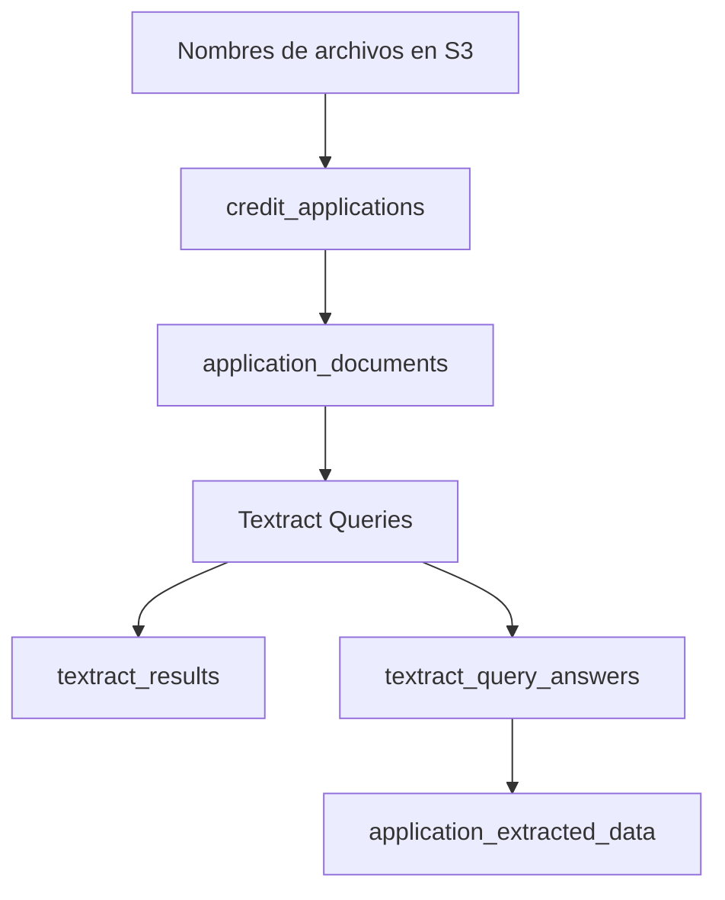

# Clase 3: Textract Queries y expediente hipotecario

| | |
|---|---|
| **Clase** | 3 de 11 |
| **Duración** | 3 horas |
| **Controlador** | `Clase03Controller` |
| **Endpoints** | `POST /modulo1/clase03/credit-files`, `POST /modulo1/clase03/credit-files/:applicationId/process`, `GET /modulo1/clase03/credit-files/:applicationId` |

## Objetivos

Al terminar esta sesión podrás:

- Crear un expediente simplificado de crédito hipotecario.
- Registrar documentos cargados por una persona.
- Configurar tipos de documento con Textract Queries.
- Extraer datos personales, laborales, ingresos, datos bancarios, solicitud y endeudamiento.
- Guardar resultados de Textract, respuestas de Queries y datos estructurados en Postgres/Supabase.

---

## Parte teórica

### Caso práctico desde esta clase

A partir de esta clase trabajaremos con un único proyecto:

```txt
Sistema simplificado de evaluación de créditos hipotecarios
```

No vamos a construir un sistema bancario real. Vamos a usar el caso para aprender extracción documental, limpieza de datos, Glue, SageMaker, modelos y explicabilidad.

Documentos del expediente:

| Documento | Qué queremos extraer |
|-----------|----------------------|
| Cédula / carné de identidad | Datos personales |
| Certificado de trabajo | Datos laborales |
| Boletas de pago | Ingresos |
| Extractos bancarios | Información bancaria |
| Formulario de solicitud | Datos de la solicitud |
| Reporte crediticio simulado | Endeudamiento e historial |

### Por qué usamos Queries

En Clase 2 probamos `AnalyzeID`, pero el carné de identidad boliviano puede no funcionar bien con esa API porque `AnalyzeID` está pensado para documentos de identidad con formatos que AWS reconoce como estándar.

Con Queries cambiamos la estrategia:

```txt
No esperamos que Textract reconozca todo el documento.
Le hacemos preguntas concretas sobre campos concretos.
```

Ejemplos:

| Pregunta (`Text`, en inglés) | Alias |
|------------------------------|-------|
| What is the identity document number? | `identity_number` |
| What date appears after Nacido el? | `birth_date` |
| What is the net monthly income? | `net_monthly_income` |
| What is the requested loan amount? | `requested_amount` |
| What is the total reported debt? | `reported_total_debt` |

### Cómo funcionan las Queries en Textract

Queries es una funcionalidad de `AnalyzeDocument`. En lugar de pedirle a Textract solamente texto, tablas o formularios, le enviamos una lista de preguntas en lenguaje natural.

La idea es:

```txt
Documento + preguntas -> Textract -> respuestas + confianza
```

Ejemplo conceptual:

```json
{
  "FeatureTypes": ["QUERIES"],
  "Document": {
    "S3Object": {
      "Bucket": "mi-bucket",
      "Name": "cliente-001/certificado-trabajo.pdf"
    }
  },
  "QueriesConfig": {
    "Queries": [
      {
        "Text": "What is the employer or company name?",
        "Alias": "employer_name_q1"
      },
      {
        "Text": "What company issues this employment certificate?",
        "Alias": "employer_name_q2"
      },
      {
        "Text": "What is the monthly salary or income?",
        "Alias": "declared_salary_q1"
      }
    ]
  }
}
```

`TargetAlias` no se envía a AWS. Es un campo interno de nuestro catálogo para saber que varias preguntas candidatas pertenecen al mismo dato final.

Parámetros importantes:

| Parámetro | Para qué sirve |
|-----------|----------------|
| `Document` | Indica el archivo a analizar. Puede venir desde S3 o como bytes, según el caso. |
| `FeatureTypes` | Debe incluir `QUERIES` para activar preguntas al documento. |
| `QueriesConfig.Queries` | Lista de preguntas que Textract intentará responder. |
| `Text` | Pregunta en **inglés** (requisito de Textract Queries). |
| `Alias` | Nombre técnico que usaremos en nuestra base de datos. |
| `Pages` | Opcional. Permite indicar en qué páginas buscar la respuesta. |

La respuesta viene en bloques. Los más importantes para esta clase son:

| Bloque | Qué representa |
|--------|----------------|
| `QUERY` | La pregunta enviada a Textract. |
| `QUERY_RESULT` | La respuesta encontrada, conectada a su pregunta y con `Confidence`. |

Por eso nuestro código busca los bloques `QUERY_RESULT`, recupera el `Alias` y guarda:

```json
{
  "alias": "declared_salary",
  "value": "8500 Bs",
  "confidence": 91.4
}
```

### Ajuste práctico para el carné boliviano

En documentos locales, como la cédula de identidad boliviana, no todos los campos conviene tratarlos igual. Si un dato no aparece como campo claro, Textract puede devolver una respuesta incorrecta con baja confianza.

Por eso, para esta clase usaremos campos que sí aparecen de forma visible en el documento:

| Campo final | Queries candidatas | TargetAlias |
|-------------|--------------------|-------------|
| Número de identidad | What is the identity document number?<br>What number appears after No.? | `identity_number` |
| Nombre completo | What is the full name of the person?<br>What name appears after A:? | `full_name` |
| Fecha de nacimiento | What is the birth date of the person?<br>What date appears after Nacido el? | `birth_date` |
| Fecha de expiración | What is the expiration date?<br>What date appears after Expira el? | `identity_expiration_date` |

No usaremos el complemento del CI en este ejercicio porque no siempre aparece como un dato separado y estable. Si Textract no encuentra ese campo, puede tomar texto cercano que no corresponde al complemento real.

También es importante separar dos momentos:

```txt
Textract extrae el valor visible.
La limpieza de datos corrige y normaliza el valor.
```

Por ejemplo, si el OCR devuelve `2 de unio de 2031`, no esperamos que la query corrija automáticamente la palabra. Esa corrección se hará más adelante en la etapa de limpieza, donde normalizaremos fechas como:

```txt
2 de unio de 2031 -> 2031-06-02
```

Cuando un campo sea difícil, se puede probar más de una pregunta para el mismo concepto. Por ejemplo:

```json
[
  {
    "Text": "What is the birth date of the person?",
    "Alias": "birth_date_q1",
    "TargetAlias": "birth_date"
  },
  {
    "Text": "What date appears after Nacido el?",
    "Alias": "birth_date_q2",
    "TargetAlias": "birth_date"
  }
]
```

En este formato, `Alias` identifica la pregunta candidata que se envía a Textract y `TargetAlias` identifica el campo final que queremos guardar. Luego el sistema se queda con la respuesta de mayor confianza para cada `TargetAlias`.

### Precio: texto plano vs Queries

Textract cobra por página procesada y el precio cambia según la API o feature usada. Los valores exactos dependen de la región y pueden cambiar; antes de procesar volumen real revisa siempre la página oficial de precios.

Como referencia, en los ejemplos oficiales de AWS para **US West (Oregon)**:

| Uso | Precio de ejemplo por página | Lectura práctica |
|-----|------------------------------|------------------|
| `DetectDocumentText` | `USD 0.0015` | Extrae texto plano. Es la opción más barata del flujo. |
| `AnalyzeDocument` con `QUERIES` | `USD 0.015` | Extrae texto y responde preguntas. En el ejemplo oficial cuesta 10 veces más que texto plano. |
| `AnalyzeDocument` con `TABLES + FORMS + QUERIES` | `USD 0.070` | Más caro porque combina varias capacidades. |
| `Custom Queries` | `USD 0.025` | Usa adaptadores personalizados entrenados para documentos de negocio. |

Para laboratorio:

- usa documentos pequeños;
- evita reprocesar el mismo archivo muchas veces;
- prueba primero con 1 o 2 páginas;
- no ejecutes loops automáticos contra Textract;
- revisa costos antes de procesar lotes grandes.

Free Tier, según AWS:

| API | Capa gratuita inicial |
|-----|-----------------------|
| `DetectDocumentText` | 1,000 páginas por mes durante los primeros 3 meses para nuevos clientes |
| `AnalyzeDocument` con Queries | 100 páginas por mes durante los primeros 3 meses para nuevos clientes |

### Consideraciones de idioma

AWS documenta soporte de detección de texto para inglés, francés, alemán, italiano, portugués y español. Sin embargo, **Queries solo acepta preguntas en inglés**: si envías `Text` en español, Textract responde con `InvalidParameterException`.

En este curso:

- el **documento** puede estar en español (carné, boleta, certificado boliviano);
- el **`Text` de cada query** va en inglés;
- el **`Alias`** es nuestro identificador interno (snake_case en inglés) y no lo ve Textract.

Con documentos bolivianos debes validar cuidadosamente:

- si la respuesta aparece correctamente;
- si la confianza es aceptable;
- si conviene usar `DetectDocumentText` o `FORMS` como respaldo;
- si el documento tiene suficiente calidad, resolución y orientación.

También recuerda:

- Textract no devuelve el idioma detectado en la respuesta.
- Para operaciones síncronas, AWS documenta hasta 15 queries por página.
- Para operaciones asíncronas, AWS documenta hasta 30 queries por página.
- Textract soporta PDF, PNG, JPEG/JPG y TIFF.

Referencias oficiales:

- [AnalyzeDocument API — QueriesConfig](https://docs.aws.amazon.com/textract/latest/APIReference/API_AnalyzeDocument.html)
- [Cuotas y límites de Amazon Textract](https://docs.aws.amazon.com/textract/latest/dg/limits-document.html)
- [Preguntas frecuentes de Amazon Textract](https://aws.amazon.com/textract/faqs/)
- [Precios de Amazon Textract](https://aws.amazon.com/textract/pricing/)

### Diseño de persistencia

En esta clase agregamos tablas para separar responsabilidades:

| Tabla | Para qué sirve |
|-------|----------------|
| `document_types` | Catálogo de tipos de documento y sus queries |
| `credit_applications` | Expediente o file del cliente |
| `application_documents` | Documentos cargados para una solicitud |
| `textract_results` | Resultado general de cada procesamiento |
| `textract_query_answers` | Respuestas individuales de Queries |
| `application_extracted_data` | Datos estructurados consolidados por solicitud |

Flujo:



---

## Parte práctica

Trabaja sobre tu repo **esqueleto**. Esta clase asume que ya tienes funcionando:

- autenticación con `ApiKeyGuard`;
- `TextractService` de Clase 1;
- endpoints de Clase 2;
- TypeORM con migraciones;
- conexión a Supabase/Postgres;
- documentos cargados en S3.

Todos los endpoints usan:

```txt
x-api-key: test1
x-api-secret: pass1
```

### 1. Crea la migración

```bash
npx typeorm-ts-node-commonjs migration:create src/migrations/CreateMortgageCreditFiles
```

Abre el archivo generado y reemplaza su contenido. Conserva el nombre de clase que TypeORM generó en tu archivo.

```typescript
import { MigrationInterface, QueryRunner } from 'typeorm';

export class CreateMortgageCreditFiles1780000000000
  implements MigrationInterface
{
  name = 'CreateMortgageCreditFiles1780000000000';

  public async up(queryRunner: QueryRunner): Promise<void> {
    const schema = process.env.DATABASE_SCHEMA ?? 'public';
    const q = `"${schema}"`;

    await queryRunner.query(`
      CREATE TABLE ${q}."document_types" (
        "id" uuid PRIMARY KEY DEFAULT gen_random_uuid(),
        "code" text NOT NULL UNIQUE,
        "name" text NOT NULL,
        "category" text NOT NULL,
        "queries" jsonb NOT NULL DEFAULT '[]'::jsonb,
        "is_active" boolean NOT NULL DEFAULT true,
        "created_at" timestamptz NOT NULL DEFAULT now()
      )
    `);

    await queryRunner.query(`
      CREATE TABLE ${q}."credit_applications" (
        "id" uuid PRIMARY KEY DEFAULT gen_random_uuid(),
        "applicant_external_id" text,
        "applicant_name" text,
        "status" text NOT NULL DEFAULT 'DOCUMENTS_REGISTERED',
        "created_at" timestamptz NOT NULL DEFAULT now(),
        "updated_at" timestamptz NOT NULL DEFAULT now()
      )
    `);

    await queryRunner.query(`
      CREATE TABLE ${q}."application_documents" (
        "id" uuid PRIMARY KEY DEFAULT gen_random_uuid(),
        "application_id" uuid NOT NULL,
        "document_type_code" text NOT NULL,
        "file_name" text NOT NULL,
        "s3_key" text NOT NULL,
        "status" text NOT NULL DEFAULT 'PENDING',
        "created_at" timestamptz NOT NULL DEFAULT now(),
        "processed_at" timestamptz,
        CONSTRAINT "FK_application_documents_application"
          FOREIGN KEY ("application_id") REFERENCES ${q}."credit_applications"("id"),
        CONSTRAINT "FK_application_documents_document_type"
          FOREIGN KEY ("document_type_code") REFERENCES ${q}."document_types"("code")
      )
    `);

    await queryRunner.query(`
      CREATE TABLE ${q}."textract_results" (
        "id" uuid PRIMARY KEY DEFAULT gen_random_uuid(),
        "application_id" uuid NOT NULL,
        "document_id" uuid NOT NULL,
        "document_type_code" text NOT NULL,
        "status" text NOT NULL,
        "raw_response" jsonb NOT NULL,
        "summary" jsonb NOT NULL DEFAULT '{}'::jsonb,
        "created_at" timestamptz NOT NULL DEFAULT now(),
        CONSTRAINT "FK_textract_results_application"
          FOREIGN KEY ("application_id") REFERENCES ${q}."credit_applications"("id"),
        CONSTRAINT "FK_textract_results_document"
          FOREIGN KEY ("document_id") REFERENCES ${q}."application_documents"("id")
      )
    `);

    await queryRunner.query(`
      CREATE TABLE ${q}."textract_query_answers" (
        "id" uuid PRIMARY KEY DEFAULT gen_random_uuid(),
        "application_id" uuid NOT NULL,
        "document_id" uuid NOT NULL,
        "document_type_code" text NOT NULL,
        "alias" text NOT NULL,
        "question" text NOT NULL,
        "value" text,
        "confidence" numeric(5,2) NOT NULL DEFAULT 0,
        "created_at" timestamptz NOT NULL DEFAULT now(),
        CONSTRAINT "FK_query_answers_application"
          FOREIGN KEY ("application_id") REFERENCES ${q}."credit_applications"("id"),
        CONSTRAINT "FK_query_answers_document"
          FOREIGN KEY ("document_id") REFERENCES ${q}."application_documents"("id")
      )
    `);

    await queryRunner.query(`
      CREATE TABLE ${q}."application_extracted_data" (
        "id" uuid PRIMARY KEY DEFAULT gen_random_uuid(),
        "application_id" uuid NOT NULL UNIQUE,
        "personal_data" jsonb NOT NULL DEFAULT '{}'::jsonb,
        "employment_data" jsonb NOT NULL DEFAULT '{}'::jsonb,
        "income_data" jsonb NOT NULL DEFAULT '{}'::jsonb,
        "banking_data" jsonb NOT NULL DEFAULT '{}'::jsonb,
        "loan_request_data" jsonb NOT NULL DEFAULT '{}'::jsonb,
        "credit_history_data" jsonb NOT NULL DEFAULT '{}'::jsonb,
        "confidence_summary" jsonb NOT NULL DEFAULT '{}'::jsonb,
        "created_at" timestamptz NOT NULL DEFAULT now(),
        "updated_at" timestamptz NOT NULL DEFAULT now(),
        CONSTRAINT "FK_application_extracted_data_application"
          FOREIGN KEY ("application_id") REFERENCES ${q}."credit_applications"("id")
      )
    `);

    await queryRunner.query(`
      INSERT INTO ${q}."document_types" ("code", "name", "category", "queries")
      VALUES
        ('CARNET_IDENTIDAD_BOLIVIANO', 'Carné de identidad boliviano', 'PERSONAL',
          '[
            { "Text": "What is the identity document number?", "Alias": "identity_number_q1", "TargetAlias": "identity_number" },
            { "Text": "What number appears after No.?", "Alias": "identity_number_q2", "TargetAlias": "identity_number" },
            { "Text": "What is the full name of the person?", "Alias": "full_name_q1", "TargetAlias": "full_name" },
            { "Text": "What name appears after A:?", "Alias": "full_name_q2", "TargetAlias": "full_name" },
            { "Text": "What is the birth date of the person?", "Alias": "birth_date_q1", "TargetAlias": "birth_date" },
            { "Text": "What date appears after Nacido el?", "Alias": "birth_date_q2", "TargetAlias": "birth_date" },
            { "Text": "What is the expiration date?", "Alias": "identity_expiration_date_q1", "TargetAlias": "identity_expiration_date" },
            { "Text": "What date appears after Expira el?", "Alias": "identity_expiration_date_q2", "TargetAlias": "identity_expiration_date" }
          ]'::jsonb),
        ('CERTIFICADO_TRABAJO', 'Certificado de trabajo', 'EMPLOYMENT',
          '[
            { "Text": "What is the employee name?", "Alias": "employee_name_q1", "TargetAlias": "employee_name" },
            { "Text": "Who is the worker or employee mentioned in the certificate?", "Alias": "employee_name_q2", "TargetAlias": "employee_name" },
            { "Text": "What person does this employment certificate refer to?", "Alias": "employee_name_q3", "TargetAlias": "employee_name" },
            { "Text": "What is the employer or company name?", "Alias": "employer_name_q1", "TargetAlias": "employer_name" },
            { "Text": "What company issues this employment certificate?", "Alias": "employer_name_q2", "TargetAlias": "employer_name" },
            { "Text": "What organization certifies the employment?", "Alias": "employer_name_q3", "TargetAlias": "employer_name" },
            { "Text": "What is the employee job title or position?", "Alias": "job_title_q1", "TargetAlias": "job_title" },
            { "Text": "What position, role, or cargo does the employee have?", "Alias": "job_title_q2", "TargetAlias": "job_title" },
            { "Text": "What is the employment start date or employment tenure?", "Alias": "employment_tenure_q1", "TargetAlias": "employment_tenure" },
            { "Text": "How long has the employee worked at the company?", "Alias": "employment_tenure_q2", "TargetAlias": "employment_tenure" },
            { "Text": "What is the monthly salary or income?", "Alias": "declared_salary_q1", "TargetAlias": "declared_salary" },
            { "Text": "What salary, sueldo, haber, or remuneration is stated?", "Alias": "declared_salary_q2", "TargetAlias": "declared_salary" }
          ]'::jsonb),
        ('BOLETA_PAGO', 'Boleta de pago', 'INCOME',
          '[
            { "Text": "What is the net monthly income or take-home pay?", "Alias": "net_monthly_income_q1", "TargetAlias": "net_monthly_income" },
            { "Text": "What is the liquid payable amount or net pay?", "Alias": "net_monthly_income_q2", "TargetAlias": "net_monthly_income" },
            { "Text": "What amount is shown as liquido pagable?", "Alias": "net_monthly_income_q3", "TargetAlias": "net_monthly_income" },
            { "Text": "What is the gross monthly income?", "Alias": "gross_monthly_income_q1", "TargetAlias": "gross_monthly_income" },
            { "Text": "What is the total earned amount or total ingresos?", "Alias": "gross_monthly_income_q2", "TargetAlias": "gross_monthly_income" },
            { "Text": "What is the total payroll deductions?", "Alias": "payroll_discounts_q1", "TargetAlias": "payroll_discounts" },
            { "Text": "What is the total descuentos or deductions amount?", "Alias": "payroll_discounts_q2", "TargetAlias": "payroll_discounts" },
            { "Text": "What month and year does the payslip correspond to?", "Alias": "payslip_month_q1", "TargetAlias": "payslip_month" },
            { "Text": "What is the payroll period, periodo, month, or gestion?", "Alias": "payslip_month_q2", "TargetAlias": "payslip_month" }
          ]'::jsonb),
        ('EXTRACTO_BANCARIO', 'Extracto bancario', 'BANKING',
          '[
            { "Text": "What is the ending balance?", "Alias": "ending_balance_q1", "TargetAlias": "ending_balance" },
            { "Text": "What is the final balance, saldo final, or current balance?", "Alias": "ending_balance_q2", "TargetAlias": "ending_balance" },
            { "Text": "What is the balance at the end of the statement period?", "Alias": "ending_balance_q3", "TargetAlias": "ending_balance" },
            { "Text": "What is the average monthly balance?", "Alias": "average_monthly_balance_q1", "TargetAlias": "average_monthly_balance" },
            { "Text": "What is the average balance or saldo promedio?", "Alias": "average_monthly_balance_q2", "TargetAlias": "average_monthly_balance" },
            { "Text": "What is the total deposits or credits?", "Alias": "total_deposits_q1", "TargetAlias": "total_deposits" },
            { "Text": "What is the total amount of abonos, deposits, or income movements?", "Alias": "total_deposits_q2", "TargetAlias": "total_deposits" },
            { "Text": "What is the total withdrawals or debits?", "Alias": "total_withdrawals_q1", "TargetAlias": "total_withdrawals" },
            { "Text": "What is the total amount of cargos, debits, withdrawals, or expenses?", "Alias": "total_withdrawals_q2", "TargetAlias": "total_withdrawals" }
          ]'::jsonb),
        ('FORMULARIO_SOLICITUD_CREDITO', 'Formulario de solicitud de crédito', 'LOAN_REQUEST',
          '[
            { "Text": "What is the requested loan amount?", "Alias": "requested_amount_q1", "TargetAlias": "requested_amount" },
            { "Text": "What amount of credit, monto solicitado, or loan amount is requested?", "Alias": "requested_amount_q2", "TargetAlias": "requested_amount" },
            { "Text": "What is the amount the applicant wants to borrow?", "Alias": "requested_amount_q3", "TargetAlias": "requested_amount" },
            { "Text": "What is the requested loan term in months?", "Alias": "requested_term_months_q1", "TargetAlias": "requested_term_months" },
            { "Text": "What plazo, term, or number of months is requested?", "Alias": "requested_term_months_q2", "TargetAlias": "requested_term_months" },
            { "Text": "What is the loan purpose or destination?", "Alias": "loan_purpose_q1", "TargetAlias": "loan_purpose" },
            { "Text": "What is the purpose, destino, or use of the requested credit?", "Alias": "loan_purpose_q2", "TargetAlias": "loan_purpose" },
            { "Text": "What is the declared property value?", "Alias": "property_value_q1", "TargetAlias": "property_value" },
            { "Text": "What is the property appraisal value, valor del inmueble, or home value?", "Alias": "property_value_q2", "TargetAlias": "property_value" }
          ]'::jsonb),
        ('REPORTE_CREDITICIO_SIMULADO', 'Reporte crediticio simulado', 'CREDIT_HISTORY',
          '[
            { "Text": "What is the total reported debt?", "Alias": "reported_total_debt_q1", "TargetAlias": "reported_total_debt" },
            { "Text": "What is the total debt, saldo de deuda, or outstanding debt?", "Alias": "reported_total_debt_q2", "TargetAlias": "reported_total_debt" },
            { "Text": "What is the total monthly debt payment?", "Alias": "monthly_debt_payment_q1", "TargetAlias": "monthly_debt_payment" },
            { "Text": "What is the monthly installment, cuota mensual, or monthly payment?", "Alias": "monthly_debt_payment_q2", "TargetAlias": "monthly_debt_payment" },
            { "Text": "How many active loans are there?", "Alias": "active_loan_count_q1", "TargetAlias": "active_loan_count" },
            { "Text": "What is the number of active credits, loans, or operaciones vigentes?", "Alias": "active_loan_count_q2", "TargetAlias": "active_loan_count" },
            { "Text": "Are there late payments or delinquencies?", "Alias": "has_late_payments_q1", "TargetAlias": "has_late_payments" },
            { "Text": "Does the report mention mora, overdue payments, arrears, or default?", "Alias": "has_late_payments_q2", "TargetAlias": "has_late_payments" }
          ]'::jsonb)
      ON CONFLICT ("code") DO NOTHING
    `);
  }

  public async down(queryRunner: QueryRunner): Promise<void> {
    const schema = process.env.DATABASE_SCHEMA ?? 'public';
    const q = `"${schema}"`;
    await queryRunner.query(`DROP TABLE IF EXISTS ${q}."application_extracted_data"`);
    await queryRunner.query(`DROP TABLE IF EXISTS ${q}."textract_query_answers"`);
    await queryRunner.query(`DROP TABLE IF EXISTS ${q}."textract_results"`);
    await queryRunner.query(`DROP TABLE IF EXISTS ${q}."application_documents"`);
    await queryRunner.query(`DROP TABLE IF EXISTS ${q}."credit_applications"`);
    await queryRunner.query(`DROP TABLE IF EXISTS ${q}."document_types"`);
  }
}
```

Ejecuta:

```bash
npm run migration:run
```

Si ya habías ejecutado esta migración antes de agregar las queries candidatas, actualiza el catálogo con una migración adicional. El patrón es:

```sql
UPDATE document_types
SET queries = '[
  { "Text": "What is the identity document number?", "Alias": "identity_number_q1", "TargetAlias": "identity_number" },
  { "Text": "What number appears after No.?", "Alias": "identity_number_q2", "TargetAlias": "identity_number" },
  { "Text": "What is the full name of the person?", "Alias": "full_name_q1", "TargetAlias": "full_name" },
  { "Text": "What name appears after A:?", "Alias": "full_name_q2", "TargetAlias": "full_name" },
  { "Text": "What is the birth date of the person?", "Alias": "birth_date_q1", "TargetAlias": "birth_date" },
  { "Text": "What date appears after Nacido el?", "Alias": "birth_date_q2", "TargetAlias": "birth_date" },
  { "Text": "What is the expiration date?", "Alias": "identity_expiration_date_q1", "TargetAlias": "identity_expiration_date" },
  { "Text": "What date appears after Expira el?", "Alias": "identity_expiration_date_q2", "TargetAlias": "identity_expiration_date" }
]'::jsonb
WHERE code = 'CARNET_IDENTIDAD_BOLIVIANO';
```

Aplica la misma idea a los demás tipos de documento: cada pregunta candidata tiene un `Alias` único y el mismo `TargetAlias` del campo final que quieres guardar. Si aún no ejecutaste la migración principal, no necesitas hacer este ajuste manual porque el catálogo ya se insertará con las queries candidatas.

### 2. Crea las entidades

Archivo: `src/entities/document-type.entity.ts`

```typescript
import { Column, CreateDateColumn, Entity, PrimaryGeneratedColumn } from 'typeorm';

export type DocumentQuery = {
  Text: string;
  Alias: string;
  TargetAlias?: string;
  Pages?: string[];
};

@Entity({ name: 'document_types' })
export class DocumentType {
  @PrimaryGeneratedColumn('uuid')
  id: string;

  @Column({ type: 'text', unique: true })
  code: string;

  @Column({ type: 'text' })
  name: string;

  @Column({ type: 'text' })
  category: string;

  @Column({ type: 'jsonb' })
  queries: DocumentQuery[];

  @Column({ name: 'is_active', type: 'boolean', default: true })
  isActive: boolean;

  @CreateDateColumn({ name: 'created_at', type: 'timestamptz' })
  createdAt: Date;
}
```

Archivo: `src/entities/credit-application.entity.ts`

```typescript
import {
  Column,
  CreateDateColumn,
  Entity,
  PrimaryGeneratedColumn,
  UpdateDateColumn,
} from 'typeorm';

@Entity({ name: 'credit_applications' })
export class CreditApplication {
  @PrimaryGeneratedColumn('uuid')
  id: string;

  @Column({ name: 'applicant_external_id', type: 'text', nullable: true })
  applicantExternalId?: string;

  @Column({ name: 'applicant_name', type: 'text', nullable: true })
  applicantName?: string;

  @Column({ type: 'text', default: 'DOCUMENTS_REGISTERED' })
  status: string;

  @CreateDateColumn({ name: 'created_at', type: 'timestamptz' })
  createdAt: Date;

  @UpdateDateColumn({ name: 'updated_at', type: 'timestamptz' })
  updatedAt: Date;
}
```

Archivo: `src/entities/application-document.entity.ts`

```typescript
import { Column, CreateDateColumn, Entity, PrimaryGeneratedColumn } from 'typeorm';

@Entity({ name: 'application_documents' })
export class ApplicationDocument {
  @PrimaryGeneratedColumn('uuid')
  id: string;

  @Column({ name: 'application_id', type: 'uuid' })
  applicationId: string;

  @Column({ name: 'document_type_code', type: 'text' })
  documentTypeCode: string;

  @Column({ name: 'file_name', type: 'text' })
  fileName: string;

  @Column({ name: 's3_key', type: 'text' })
  s3Key: string;

  @Column({ type: 'text', default: 'PENDING' })
  status: string;

  @CreateDateColumn({ name: 'created_at', type: 'timestamptz' })
  createdAt: Date;

  @Column({ name: 'processed_at', type: 'timestamptz', nullable: true })
  processedAt?: Date;
}
```

Archivo: `src/entities/textract-result.entity.ts`

```typescript
import { Column, CreateDateColumn, Entity, PrimaryGeneratedColumn } from 'typeorm';

@Entity({ name: 'textract_results' })
export class TextractResult {
  @PrimaryGeneratedColumn('uuid')
  id: string;

  @Column({ name: 'application_id', type: 'uuid' })
  applicationId: string;

  @Column({ name: 'document_id', type: 'uuid' })
  documentId: string;

  @Column({ name: 'document_type_code', type: 'text' })
  documentTypeCode: string;

  @Column({ type: 'text' })
  status: string;

  @Column({ name: 'raw_response', type: 'jsonb' })
  rawResponse: unknown;

  @Column({ type: 'jsonb' })
  summary: unknown;

  @CreateDateColumn({ name: 'created_at', type: 'timestamptz' })
  createdAt: Date;
}
```

Archivo: `src/entities/textract-query-answer.entity.ts`

```typescript
import { Column, CreateDateColumn, Entity, PrimaryGeneratedColumn } from 'typeorm';

@Entity({ name: 'textract_query_answers' })
export class TextractQueryAnswer {
  @PrimaryGeneratedColumn('uuid')
  id: string;

  @Column({ name: 'application_id', type: 'uuid' })
  applicationId: string;

  @Column({ name: 'document_id', type: 'uuid' })
  documentId: string;

  @Column({ name: 'document_type_code', type: 'text' })
  documentTypeCode: string;

  @Column({ type: 'text' })
  alias: string;

  @Column({ type: 'text' })
  question: string;

  @Column({ type: 'text', nullable: true })
  value?: string;

  @Column({ type: 'numeric', precision: 5, scale: 2, default: 0 })
  confidence: number;

  @CreateDateColumn({ name: 'created_at', type: 'timestamptz' })
  createdAt: Date;
}
```

Archivo: `src/entities/application-extracted-data.entity.ts`

```typescript
import {
  Column,
  CreateDateColumn,
  Entity,
  PrimaryGeneratedColumn,
  UpdateDateColumn,
} from 'typeorm';

@Entity({ name: 'application_extracted_data' })
export class ApplicationExtractedData {
  @PrimaryGeneratedColumn('uuid')
  id: string;

  @Column({ name: 'application_id', type: 'uuid', unique: true })
  applicationId: string;

  @Column({ name: 'personal_data', type: 'jsonb', default: {} })
  personalData: Record<string, unknown>;

  @Column({ name: 'employment_data', type: 'jsonb', default: {} })
  employmentData: Record<string, unknown>;

  @Column({ name: 'income_data', type: 'jsonb', default: {} })
  incomeData: Record<string, unknown>;

  @Column({ name: 'banking_data', type: 'jsonb', default: {} })
  bankingData: Record<string, unknown>;

  @Column({ name: 'loan_request_data', type: 'jsonb', default: {} })
  loanRequestData: Record<string, unknown>;

  @Column({ name: 'credit_history_data', type: 'jsonb', default: {} })
  creditHistoryData: Record<string, unknown>;

  @Column({ name: 'confidence_summary', type: 'jsonb', default: {} })
  confidenceSummary: Record<string, unknown>;

  @CreateDateColumn({ name: 'created_at', type: 'timestamptz' })
  createdAt: Date;

  @UpdateDateColumn({ name: 'updated_at', type: 'timestamptz' })
  updatedAt: Date;
}
```

### 3. Extiende `TextractService`

Archivo: `src/modulo1/clase01/textract.service.ts`

Añade `Query` al import del SDK:

```typescript
import {
  AnalyzeDocumentCommand,
  AnalyzeExpenseCommand,
  AnalyzeIDCommand,
  DetectDocumentTextCommand,
  Query,
  TextractClient,
  UnsupportedDocumentException,
} from '@aws-sdk/client-textract';
```

Dentro de `TextractService`, añade:

```typescript
  async analyzeWithQueries(s3Key: string, queries: Query[]) {
    this.assertSupportedFormat(s3Key);

    const command = new AnalyzeDocumentCommand({
      Document: {
        S3Object: {
          Bucket: this.config.getOrThrow<string>('AWS_S3_BUCKET'),
          Name: s3Key,
        },
      },
      FeatureTypes: ['QUERIES'],
      QueriesConfig: {
        Queries: queries,
      },
    });

    return await this.client.send(command);
  }
```

### 4. Crea `Clase03Service`

Archivo: `src/modulo1/clase03/clase03.service.ts`

```typescript
import { BadRequestException, Injectable, NotFoundException } from '@nestjs/common';
import { Block } from '@aws-sdk/client-textract';
import { InjectRepository } from '@nestjs/typeorm';
import { In, Repository } from 'typeorm';
import { ApplicationDocument } from '../../entities/application-document.entity';
import { ApplicationExtractedData } from '../../entities/application-extracted-data.entity';
import { CreditApplication } from '../../entities/credit-application.entity';
import { DocumentQuery, DocumentType } from '../../entities/document-type.entity';
import { TextractQueryAnswer } from '../../entities/textract-query-answer.entity';
import { TextractResult } from '../../entities/textract-result.entity';
import { TextractService } from '../clase01/textract.service';

type CreateCreditFileBody = {
  applicantExternalId?: string;
  applicantName?: string;
  documents: {
    documentType: string;
    fileName: string;
  }[];
};

type ParsedAnswer = {
  alias: string;
  targetAlias: string;
  question: string;
  value: string;
  confidence: number;
  selectedFrom?: string;
};

@Injectable()
export class Clase03Service {
  constructor(
    private readonly textract: TextractService,
    @InjectRepository(CreditApplication)
    private readonly applications: Repository<CreditApplication>,
    @InjectRepository(ApplicationDocument)
    private readonly documents: Repository<ApplicationDocument>,
    @InjectRepository(DocumentType)
    private readonly documentTypes: Repository<DocumentType>,
    @InjectRepository(TextractResult)
    private readonly textractResults: Repository<TextractResult>,
    @InjectRepository(TextractQueryAnswer)
    private readonly queryAnswers: Repository<TextractQueryAnswer>,
    @InjectRepository(ApplicationExtractedData)
    private readonly extractedData: Repository<ApplicationExtractedData>,
  ) {}

  async createCreditFile(body: CreateCreditFileBody) {
    if (!body.documents?.length) {
      throw new BadRequestException('documents is required');
    }

    const codes = body.documents.map((item) => item.documentType.toUpperCase());
    const existingTypes = await this.documentTypes.find({
      where: { code: In(codes), isActive: true },
    });
    const validCodes = new Set(existingTypes.map((item) => item.code));
    const invalidCode = codes.find((code) => !validCodes.has(code));

    if (invalidCode) {
      throw new BadRequestException(`Unknown documentType: ${invalidCode}`);
    }

    const application = await this.applications.save(
      this.applications.create({
        applicantExternalId: body.applicantExternalId,
        applicantName: body.applicantName,
        status: 'DOCUMENTS_REGISTERED',
      }),
    );

    const documents = await this.documents.save(
      body.documents.map((item) =>
        this.documents.create({
          applicationId: application.id,
          documentTypeCode: item.documentType.toUpperCase(),
          fileName: item.fileName,
          s3Key: item.fileName,
          status: 'PENDING',
        }),
      ),
    );

    return {
      applicationId: application.id,
      status: application.status,
      documents,
    };
  }

  async processCreditFile(applicationId: string) {
    const application = await this.getApplication(applicationId);
    const documents = await this.documents.find({ where: { applicationId } });

    if (!documents.length) {
      throw new BadRequestException('The credit file has no documents');
    }

    const processed: unknown[] = [];

    for (const document of documents) {
      const documentType = await this.getDocumentType(document.documentTypeCode);
      const textractQueries = this.toTextractQueries(documentType.queries);
      await this.clearPreviousTextractData(applicationId, document.id);
      const response = await this.textract.analyzeWithQueries(
        document.s3Key,
        textractQueries,
      );
      const candidateAnswers = this.parseQueryAnswers(
        response.Blocks ?? [],
        documentType.queries,
      );
      const answers = this.selectBestAnswers(candidateAnswers);

      await this.textractResults.save(
        this.textractResults.create({
          applicationId,
          documentId: document.id,
          documentTypeCode: document.documentTypeCode,
          status: 'SUCCEEDED',
          rawResponse: response,
          summary: {
            answerCount: answers.length,
            candidateCount: candidateAnswers.length,
            averageConfidence: this.averageConfidence(answers),
          },
        }),
      );

      await this.queryAnswers.save(
        answers.map((answer) =>
          this.queryAnswers.create({
            applicationId,
            documentId: document.id,
            documentTypeCode: document.documentTypeCode,
            alias: answer.targetAlias,
            question: answer.question,
            value: answer.value,
            confidence: answer.confidence,
          }),
        ),
      );

      await this.documents.update(document.id, {
        status: 'PROCESSED',
        processedAt: new Date(),
      });

      processed.push({
        documentId: document.id,
        documentType: document.documentTypeCode,
        answers,
      });
    }

    await this.rebuildExtractedData(applicationId);
    await this.applications.update(application.id, { status: 'TEXTRACT_COMPLETED' });

    return {
      applicationId,
      status: 'TEXTRACT_COMPLETED',
      processed,
    };
  }

  async getCreditFile(applicationId: string) {
    const application = await this.getApplication(applicationId);
    const documents = await this.documents.find({ where: { applicationId } });
    const extractedData = await this.extractedData.findOne({
      where: { applicationId },
    });

    return {
      application,
      documents,
      extractedData,
    };
  }

  private async getApplication(applicationId: string) {
    const application = await this.applications.findOne({
      where: { id: applicationId },
    });

    if (!application) {
      throw new NotFoundException(`Application not found: ${applicationId}`);
    }

    return application;
  }

  private async getDocumentType(code: string) {
    const documentType = await this.documentTypes.findOne({
      where: { code, isActive: true },
    });

    if (!documentType) {
      throw new BadRequestException(`Unknown documentType: ${code}`);
    }

    if (!documentType.queries.length) {
      throw new BadRequestException(`documentType ${code} has no queries`);
    }

    return documentType;
  }

  private async clearPreviousTextractData(applicationId: string, documentId: string) {
    await this.queryAnswers.delete({ applicationId, documentId });
    await this.textractResults.delete({ applicationId, documentId });
  }

  private toTextractQueries(queries: DocumentQuery[]) {
    return queries.map((query) => ({
      Text: query.Text,
      Alias: query.Alias,
      Pages: query.Pages,
    }));
  }

  private parseQueryAnswers(
    blocks: Block[],
    configuredQueries: DocumentQuery[],
  ): ParsedAnswer[] {
    const targetAliasByAlias = new Map(
      configuredQueries.map((query) => [
        query.Alias,
        query.TargetAlias ?? query.Alias,
      ]),
    );
    const resultBlocks = blocks.filter(
      (block) => block.BlockType === 'QUERY_RESULT',
    );

    return resultBlocks.map((result) => {
      const query = blocks.find((block) =>
        block.Relationships?.some(
          (relationship) =>
            relationship.Type === 'ANSWER' &&
            relationship.Ids?.includes(result.Id ?? ''),
        ),
      );

      return {
        alias: query?.Query?.Alias ?? query?.Query?.Text ?? 'unknown',
        targetAlias:
          targetAliasByAlias.get(query?.Query?.Alias ?? '') ??
          query?.Query?.Alias ??
          query?.Query?.Text ??
          'unknown',
        question: query?.Query?.Text ?? '',
        value: result.Text ?? '',
        confidence: Number((result.Confidence ?? 0).toFixed(2)),
      };
    });
  }

  private selectBestAnswers(candidates: ParsedAnswer[]) {
    const bestByTargetAlias = new Map<string, ParsedAnswer>();

    for (const candidate of candidates) {
      if (!candidate.value?.trim()) continue;

      const current = bestByTargetAlias.get(candidate.targetAlias);
      if (!current || candidate.confidence > current.confidence) {
        bestByTargetAlias.set(candidate.targetAlias, {
          ...candidate,
          selectedFrom: candidate.alias,
          alias: candidate.targetAlias,
        });
      }
    }

    return [...bestByTargetAlias.values()];
  }

  private async rebuildExtractedData(applicationId: string) {
    const answers = await this.queryAnswers.find({ where: { applicationId } });
    const grouped = this.groupAnswers(answers);
    const confidenceValues = answers.map((answer) => Number(answer.confidence));

    const payload = {
      applicationId,
      personalData: grouped.PERSONAL,
      employmentData: grouped.EMPLOYMENT,
      incomeData: grouped.INCOME,
      bankingData: grouped.BANKING,
      loanRequestData: grouped.LOAN_REQUEST,
      creditHistoryData: grouped.CREDIT_HISTORY,
      confidenceSummary: {
        average: this.average(confidenceValues),
        minimum: confidenceValues.length ? Math.min(...confidenceValues) : 0,
      },
    };

    const existing = await this.extractedData.findOne({ where: { applicationId } });
    await this.extractedData.save(
      existing ? { ...existing, ...payload } : this.extractedData.create(payload),
    );
  }

  private groupAnswers(answers: TextractQueryAnswer[]) {
    const groups: Record<string, Record<string, unknown>> = {
      PERSONAL: {},
      EMPLOYMENT: {},
      INCOME: {},
      BANKING: {},
      LOAN_REQUEST: {},
      CREDIT_HISTORY: {},
    };

    for (const answer of answers) {
      const category = this.categoryFromDocumentType(answer.documentTypeCode);
      groups[category][answer.alias] = {
        value: answer.value,
        confidence: Number(answer.confidence),
      };
    }

    return groups;
  }

  private categoryFromDocumentType(code: string) {
    if (code === 'CARNET_IDENTIDAD_BOLIVIANO') return 'PERSONAL';
    if (code === 'CERTIFICADO_TRABAJO') return 'EMPLOYMENT';
    if (code === 'BOLETA_PAGO') return 'INCOME';
    if (code === 'EXTRACTO_BANCARIO') return 'BANKING';
    if (code === 'FORMULARIO_SOLICITUD_CREDITO') return 'LOAN_REQUEST';
    if (code === 'REPORTE_CREDITICIO_SIMULADO') return 'CREDIT_HISTORY';
    return 'PERSONAL';
  }

  private averageConfidence(answers: ParsedAnswer[]) {
    return this.average(answers.map((answer) => answer.confidence));
  }

  private average(values: number[]) {
    if (!values.length) return 0;
    const total = values.reduce((sum, value) => sum + value, 0);
    return Number((total / values.length).toFixed(2));
  }
}
```

### 5. Crea el controller

Archivo: `src/modulo1/clase03/clase03.controller.ts`

```typescript
import { Body, Controller, Get, Param, Post, UseGuards } from '@nestjs/common';
import { ApiKeyGuard } from '../../auth/guards/api-key.guard';
import { Clase03Service } from './clase03.service';

@Controller('modulo1/clase03')
@UseGuards(ApiKeyGuard)
export class Clase03Controller {
  constructor(private readonly clase03: Clase03Service) {}

  @Post('credit-files')
  async createCreditFile(
    @Body()
    body: {
      applicantExternalId?: string;
      applicantName?: string;
      documents: { documentType: string; fileName: string }[];
    },
  ) {
    return await this.clase03.createCreditFile(body);
  }

  @Post('credit-files/:applicationId/process')
  async processCreditFile(@Param('applicationId') applicationId: string) {
    return await this.clase03.processCreditFile(applicationId);
  }

  @Get('credit-files/:applicationId')
  async getCreditFile(@Param('applicationId') applicationId: string) {
    return await this.clase03.getCreditFile(applicationId);
  }
}
```

### 6. Actualiza `Modulo1Module`

Archivo: `src/modulo1/modulo1.module.ts`

```typescript
import { Module } from '@nestjs/common';
import { TypeOrmModule } from '@nestjs/typeorm';
import { AuthModule } from '../auth/auth.module';
import { ApplicationDocument } from '../entities/application-document.entity';
import { ApplicationExtractedData } from '../entities/application-extracted-data.entity';
import { CreditApplication } from '../entities/credit-application.entity';
import { DocumentType } from '../entities/document-type.entity';
import { RawDocumentText } from '../entities/raw-document-text.entity';
import { TextractQueryAnswer } from '../entities/textract-query-answer.entity';
import { TextractResult } from '../entities/textract-result.entity';
import { Clase01Controller } from './clase01/clase01.controller';
import { Clase01Service } from './clase01/clase01.service';
import { TextractService } from './clase01/textract.service';
import { Clase02Controller } from './clase02/clase02.controller';
import { Clase02Service } from './clase02/clase02.service';
import { Clase03Controller } from './clase03/clase03.controller';
import { Clase03Service } from './clase03/clase03.service';

@Module({
  imports: [
    AuthModule,
    TypeOrmModule.forFeature([
      RawDocumentText,
      CreditApplication,
      ApplicationDocument,
      DocumentType,
      TextractResult,
      TextractQueryAnswer,
      ApplicationExtractedData,
    ]),
  ],
  controllers: [Clase01Controller, Clase02Controller, Clase03Controller],
  providers: [Clase01Service, Clase02Service, Clase03Service, TextractService],
})
export class Modulo1Module {}
```

### 7. Prueba el flujo

Primero registra el expediente:

```bash
curl -X POST http://localhost:3000/modulo1/clase03/credit-files \
  -H "Content-Type: application/json" \
  -H "x-api-key: test1" \
  -H "x-api-secret: pass1" \
  -d '{
    "applicantExternalId": "CLI-001",
    "applicantName": "Cliente Demo",
    "documents": [
      { "documentType": "CARNET_IDENTIDAD_BOLIVIANO", "fileName": "cliente-001/carnet.jpg" },
      { "documentType": "CERTIFICADO_TRABAJO", "fileName": "cliente-001/certificado-trabajo.pdf" },
      { "documentType": "BOLETA_PAGO", "fileName": "cliente-001/boleta-pago-01.pdf" },
      { "documentType": "EXTRACTO_BANCARIO", "fileName": "cliente-001/extracto-bancario.pdf" },
      { "documentType": "FORMULARIO_SOLICITUD_CREDITO", "fileName": "cliente-001/solicitud.pdf" },
      { "documentType": "REPORTE_CREDITICIO_SIMULADO", "fileName": "cliente-001/reporte-crediticio.pdf" }
    ]
  }'
```

Luego procesa los documentos. Reemplaza `APPLICATION_ID` por el valor devuelto:

```bash
curl -X POST http://localhost:3000/modulo1/clase03/credit-files/APPLICATION_ID/process \
  -H "x-api-key: test1" \
  -H "x-api-secret: pass1"
```

Consulta el expediente:

```bash
curl http://localhost:3000/modulo1/clase03/credit-files/APPLICATION_ID \
  -H "x-api-key: test1" \
  -H "x-api-secret: pass1"
```

### 8. Entrega

- Captura del expediente creado.
- Captura del procesamiento con Textract Queries.
- Evidencia de registros en `textract_query_answers`.
- Evidencia de datos consolidados en `application_extracted_data`.
- Explicación breve de qué campos tuvieron confianza baja.

## Recursos

- [Textract Queries](https://docs.aws.amazon.com/textract/latest/dg/queryresponse.html)
- [AnalyzeDocument](https://docs.aws.amazon.com/textract/latest/dg/API_AnalyzeDocument.html)
- [TypeORM Entities](https://typeorm.io/entities)
- [PostgreSQL JSON Types](https://www.postgresql.org/docs/current/datatype-json.html)
