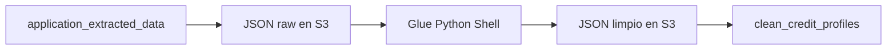

# Clase 4: AWS Glue para limpiar el expediente hipotecario

| | |
|---|---|
| **Clase** | 4 de 11 |
| **Duración** | 3 horas |
| **Controlador** | `Clase04Controller` |
| **Endpoints** | `POST /modulo1/clase04/credit-files`, `POST /modulo1/clase04/credit-files/clean`, `GET /modulo1/clase04/credit-files/:applicationId/clean-status` |

## Objetivos

Al terminar esta sesión podrás:

- Explicar por qué Glue se usa después de Textract.
- Crear un job de limpieza que normaliza datos del expediente.
- Convertir fechas, montos y textos a formatos consistentes.
- Guardar un perfil limpio del cliente en Postgres/Supabase.
- Usar un endpoint unificado para iniciar la limpieza de un file hipotecario.

---

## Parte teórica

### Qué problema resolvemos

En Clase 3 guardamos respuestas de Textract Queries. Esas respuestas todavía son texto:

```json
{
  "requested_amount": { "value": "Bs. 450.000", "confidence": 91.4 },
  "net_monthly_income": { "value": "8,500 bolivianos", "confidence": 88.2 }
}
```

Para Machine Learning necesitamos datos limpios:

```json
{
  "requested_amount": 450000,
  "net_monthly_income": 8500
}
```

### Qué hará Glue

Glue será la capa de transformación:



Transformaciones:

| Transformación | Ejemplo |
|----------------|---------|
| Normalizar fechas | `15/05/2026` -> `2026-05-15` |
| Convertir montos | `Bs. 450.000` -> `450000` |
| Limpiar texto | espacios, símbolos, mayúsculas |
| Homologar campos | `ci`, `carnet`, `identity_number` -> `identity_number` |
| Variables derivadas | `estimated_monthly_payment`, `initial_debt_to_income_ratio` |

### Endpoint unificado

Desde esta clase tendremos un endpoint unificado:

```txt
POST /modulo1/clase04/credit-files
  -> registra expediente
  -> procesa documentos con Textract Queries
  -> lanza Glue
  -> prepara el perfil limpio del cliente
```

También conservamos un endpoint secundario para limpiar un expediente que ya fue creado y procesado en Clase 3:

```txt
POST /modulo1/clase04/credit-files/clean
```

---

## Parte práctica

### 1. Crea la migración

```bash
npx typeorm-ts-node-commonjs migration:create src/migrations/CreateCleanCreditProfiles
```

Reemplaza el contenido, conservando el nombre de clase generado:

```typescript
import { MigrationInterface, QueryRunner } from 'typeorm';

export class CreateCleanCreditProfiles1780000000001
  implements MigrationInterface
{
  name = 'CreateCleanCreditProfiles1780000000001';

  public async up(queryRunner: QueryRunner): Promise<void> {
    const schema = process.env.DATABASE_SCHEMA ?? 'public';
    const q = `"${schema}"`;

    await queryRunner.query(`
      CREATE TABLE ${q}."clean_credit_profiles" (
        "id" uuid PRIMARY KEY DEFAULT gen_random_uuid(),
        "application_id" uuid NOT NULL UNIQUE,
        "applicant_name" text,
        "identity_number" text,
        "birth_date" date,
        "employer_name" text,
        "job_title" text,
        "employment_tenure_months" integer,
        "net_monthly_income" numeric(14,2),
        "gross_monthly_income" numeric(14,2),
        "average_monthly_balance" numeric(14,2),
        "requested_amount" numeric(14,2),
        "requested_term_months" integer,
        "property_value" numeric(14,2),
        "reported_total_debt" numeric(14,2),
        "monthly_debt_payment" numeric(14,2),
        "active_loan_count" integer,
        "has_late_payments" boolean,
        "estimated_monthly_payment" numeric(14,2),
        "initial_debt_to_income_ratio" numeric(8,4),
        "clean_payload" jsonb NOT NULL DEFAULT '{}'::jsonb,
        "quality_report" jsonb NOT NULL DEFAULT '{}'::jsonb,
        "created_at" timestamptz NOT NULL DEFAULT now(),
        "updated_at" timestamptz NOT NULL DEFAULT now(),
        CONSTRAINT "FK_clean_credit_profiles_application"
          FOREIGN KEY ("application_id") REFERENCES ${q}."credit_applications"("id")
      )
    `);

    await queryRunner.query(`
      CREATE TABLE ${q}."glue_job_runs" (
        "id" uuid PRIMARY KEY DEFAULT gen_random_uuid(),
        "application_id" uuid NOT NULL,
        "job_name" text NOT NULL,
        "job_run_id" text NOT NULL,
        "job_type" text NOT NULL,
        "status" text NOT NULL DEFAULT 'STARTING',
        "input_path" text,
        "output_path" text,
        "created_at" timestamptz NOT NULL DEFAULT now(),
        "updated_at" timestamptz NOT NULL DEFAULT now(),
        CONSTRAINT "FK_glue_job_runs_application"
          FOREIGN KEY ("application_id") REFERENCES ${q}."credit_applications"("id")
      )
    `);
  }

  public async down(queryRunner: QueryRunner): Promise<void> {
    const schema = process.env.DATABASE_SCHEMA ?? 'public';
    const q = `"${schema}"`;
    await queryRunner.query(`DROP TABLE IF EXISTS ${q}."glue_job_runs"`);
    await queryRunner.query(`DROP TABLE IF EXISTS ${q}."clean_credit_profiles"`);
  }
}
```

Ejecuta:

```bash
npm run migration:run
```

### 2. Crea las entidades

Archivo: `src/entities/clean-credit-profile.entity.ts`

```typescript
import {
  Column,
  CreateDateColumn,
  Entity,
  PrimaryGeneratedColumn,
  UpdateDateColumn,
} from 'typeorm';

@Entity({ name: 'clean_credit_profiles' })
export class CleanCreditProfile {
  @PrimaryGeneratedColumn('uuid')
  id: string;

  @Column({ name: 'application_id', type: 'uuid', unique: true })
  applicationId: string;

  @Column({ name: 'applicant_name', type: 'text', nullable: true })
  applicantName?: string;

  @Column({ name: 'identity_number', type: 'text', nullable: true })
  identityNumber?: string;

  @Column({ name: 'birth_date', type: 'date', nullable: true })
  birthDate?: string;

  @Column({ name: 'employer_name', type: 'text', nullable: true })
  employerName?: string;

  @Column({ name: 'job_title', type: 'text', nullable: true })
  jobTitle?: string;

  @Column({ name: 'employment_tenure_months', type: 'integer', nullable: true })
  employmentTenureMonths?: number;

  @Column({ name: 'net_monthly_income', type: 'numeric', nullable: true })
  netMonthlyIncome?: number;

  @Column({ name: 'gross_monthly_income', type: 'numeric', nullable: true })
  grossMonthlyIncome?: number;

  @Column({ name: 'average_monthly_balance', type: 'numeric', nullable: true })
  averageMonthlyBalance?: number;

  @Column({ name: 'requested_amount', type: 'numeric', nullable: true })
  requestedAmount?: number;

  @Column({ name: 'requested_term_months', type: 'integer', nullable: true })
  requestedTermMonths?: number;

  @Column({ name: 'property_value', type: 'numeric', nullable: true })
  propertyValue?: number;

  @Column({ name: 'reported_total_debt', type: 'numeric', nullable: true })
  reportedTotalDebt?: number;

  @Column({ name: 'monthly_debt_payment', type: 'numeric', nullable: true })
  monthlyDebtPayment?: number;

  @Column({ name: 'active_loan_count', type: 'integer', nullable: true })
  activeLoanCount?: number;

  @Column({ name: 'has_late_payments', type: 'boolean', nullable: true })
  hasLatePayments?: boolean;

  @Column({ name: 'estimated_monthly_payment', type: 'numeric', nullable: true })
  estimatedMonthlyPayment?: number;

  @Column({ name: 'initial_debt_to_income_ratio', type: 'numeric', nullable: true })
  initialDebtToIncomeRatio?: number;

  @Column({ name: 'clean_payload', type: 'jsonb', default: {} })
  cleanPayload: Record<string, unknown>;

  @Column({ name: 'quality_report', type: 'jsonb', default: {} })
  qualityReport: Record<string, unknown>;

  @CreateDateColumn({ name: 'created_at', type: 'timestamptz' })
  createdAt: Date;

  @UpdateDateColumn({ name: 'updated_at', type: 'timestamptz' })
  updatedAt: Date;
}
```

Archivo: `src/entities/glue-job-run.entity.ts`

```typescript
import {
  Column,
  CreateDateColumn,
  Entity,
  PrimaryGeneratedColumn,
  UpdateDateColumn,
} from 'typeorm';

@Entity({ name: 'glue_job_runs' })
export class GlueJobRunEntity {
  @PrimaryGeneratedColumn('uuid')
  id: string;

  @Column({ name: 'application_id', type: 'uuid' })
  applicationId: string;

  @Column({ name: 'job_name', type: 'text' })
  jobName: string;

  @Column({ name: 'job_run_id', type: 'text' })
  jobRunId: string;

  @Column({ name: 'job_type', type: 'text' })
  jobType: string;

  @Column({ type: 'text', default: 'STARTING' })
  status: string;

  @Column({ name: 'input_path', type: 'text', nullable: true })
  inputPath?: string;

  @Column({ name: 'output_path', type: 'text', nullable: true })
  outputPath?: string;

  @CreateDateColumn({ name: 'created_at', type: 'timestamptz' })
  createdAt: Date;

  @UpdateDateColumn({ name: 'updated_at', type: 'timestamptz' })
  updatedAt: Date;
}
```

### 3. Instala Glue SDK y variables

```bash
npm install @aws-sdk/client-glue @aws-sdk/client-s3
```

Agrega a `.env`:

```env
AWS_GLUE_CLEAN_JOB_NAME=clean-mortgage-credit-file
AWS_S3_RAW_PREFIX=raw/credit-files
AWS_S3_CLEAN_PREFIX=processed/credit-files
```

### 4. Script Glue de limpieza

En S3 o en la consola Glue crea un script Python Shell llamado `clean-mortgage-credit-file.py`.

```python
import json
import re
import sys
from datetime import datetime
import boto3
from awsglue.utils import getResolvedOptions

args = getResolvedOptions(
    sys.argv,
    ["BUCKET", "APPLICATION_ID", "INPUT_KEY", "OUTPUT_KEY", "CONFIDENCE_THRESHOLD"],
)

s3 = boto3.client("s3")
threshold = float(args["CONFIDENCE_THRESHOLD"])

def read_json(bucket, key):
    obj = s3.get_object(Bucket=bucket, Key=key)
    return json.loads(obj["Body"].read().decode("utf-8"))

def write_json(bucket, key, data):
    s3.put_object(
        Bucket=bucket,
        Key=key,
        Body=json.dumps(data, ensure_ascii=False, indent=2).encode("utf-8"),
        ContentType="application/json",
    )

def get_value(section, alias):
    item = (section or {}).get(alias)
    if isinstance(item, dict):
        if float(item.get("confidence") or 0) < threshold:
            return None
        return item.get("value")
    return item

def clean_money(value):
    if value is None:
        return None
    text = str(value).replace(",", ".")
    text = re.sub(r"[^0-9.]", "", text)
    if not text:
        return None
    parts = text.split(".")
    if len(parts) > 2:
        text = "".join(parts[:-1]) + "." + parts[-1]
    return round(float(text), 2)

def clean_int(value):
    if value is None:
        return None
    match = re.search(r"\d+", str(value))
    return int(match.group()) if match else None

def clean_bool(value):
    if value is None:
        return None
    text = str(value).lower()
    if any(word in text for word in ["si", "sí", "yes", "true", "mora"]):
        return True
    if any(word in text for word in ["no", "false"]):
        return False
    return None

def clean_date(value):
    if value is None:
        return None
    text = str(value).strip()
    for fmt in ("%d/%m/%Y", "%Y-%m-%d", "%d-%m-%Y"):
        try:
            return datetime.strptime(text, fmt).date().isoformat()
        except ValueError:
            pass
    return None

raw = read_json(args["BUCKET"], args["INPUT_KEY"])

personal = raw.get("personalData", {})
employment = raw.get("employmentData", {})
income = raw.get("incomeData", {})
banking = raw.get("bankingData", {})
loan = raw.get("loanRequestData", {})
credit = raw.get("creditHistoryData", {})

net_income = clean_money(get_value(income, "net_monthly_income"))
monthly_debt = clean_money(get_value(credit, "monthly_debt_payment"))
requested_amount = clean_money(get_value(loan, "requested_amount"))
term_months = clean_int(get_value(loan, "requested_term_months")) or 240
estimated_payment = round(requested_amount / term_months, 2) if requested_amount else None

clean = {
    "application_id": args["APPLICATION_ID"],
    "applicant_name": get_value(personal, "full_name") or get_value(employment, "employee_name"),
    "identity_number": get_value(personal, "identity_number"),
    "birth_date": clean_date(get_value(personal, "birth_date")),
    "employer_name": get_value(employment, "employer_name"),
    "job_title": get_value(employment, "job_title"),
    "employment_tenure_months": clean_int(get_value(employment, "employment_tenure")),
    "net_monthly_income": net_income,
    "gross_monthly_income": clean_money(get_value(income, "gross_monthly_income")),
    "average_monthly_balance": clean_money(get_value(banking, "average_monthly_balance")),
    "requested_amount": requested_amount,
    "requested_term_months": term_months,
    "property_value": clean_money(get_value(loan, "property_value")),
    "reported_total_debt": clean_money(get_value(credit, "reported_total_debt")),
    "monthly_debt_payment": monthly_debt,
    "active_loan_count": clean_int(get_value(credit, "active_loan_count")),
    "has_late_payments": clean_bool(get_value(credit, "has_late_payments")),
    "estimated_monthly_payment": estimated_payment,
    "initial_debt_to_income_ratio": round((monthly_debt or 0) / net_income, 4) if net_income else None,
}

quality = {
    "missing_fields": [key for key, value in clean.items() if value is None],
    "confidence_threshold": threshold,
}

write_json(args["BUCKET"], args["OUTPUT_KEY"], {
    "clean": clean,
    "quality_report": quality,
})
```

### 5. Crea `GlueService`

Archivo: `src/modulo1/clase04/glue.service.ts`

```typescript
import { Injectable } from '@nestjs/common';
import { ConfigService } from '@nestjs/config';
import {
  GetJobRunCommand,
  GlueClient,
  StartJobRunCommand,
} from '@aws-sdk/client-glue';

@Injectable()
export class GlueService {
  private readonly client: GlueClient;

  constructor(private readonly config: ConfigService) {
    this.client = new GlueClient({
      region: this.config.getOrThrow<string>('AWS_REGION'),
    });
  }

  async startCleanJob(args: {
    applicationId: string;
    inputKey: string;
    outputKey: string;
  }) {
    const jobName = this.config.getOrThrow<string>('AWS_GLUE_CLEAN_JOB_NAME');

    const command = new StartJobRunCommand({
      JobName: jobName,
      Arguments: {
        '--BUCKET': this.config.getOrThrow<string>('AWS_S3_BUCKET'),
        '--APPLICATION_ID': args.applicationId,
        '--INPUT_KEY': args.inputKey,
        '--OUTPUT_KEY': args.outputKey,
        '--CONFIDENCE_THRESHOLD': '80',
      },
    });

    const response = await this.client.send(command);
    return {
      jobName,
      jobRunId: response.JobRunId!,
    };
  }

  async getJobStatus(jobName: string, jobRunId: string) {
    const response = await this.client.send(
      new GetJobRunCommand({
        JobName: jobName,
        RunId: jobRunId,
        PredecessorsIncluded: false,
      }),
    );

    return response.JobRun?.JobRunState ?? 'UNKNOWN';
  }
}
```

### 6. Crea `Clase04Service`

Archivo: `src/modulo1/clase04/clase04.service.ts`

```typescript
import { BadRequestException, Injectable, NotFoundException } from '@nestjs/common';
import { ConfigService } from '@nestjs/config';
import { GetObjectCommand, PutObjectCommand, S3Client } from '@aws-sdk/client-s3';
import { InjectRepository } from '@nestjs/typeorm';
import { Repository } from 'typeorm';
import { ApplicationExtractedData } from '../../entities/application-extracted-data.entity';
import { CleanCreditProfile } from '../../entities/clean-credit-profile.entity';
import { GlueJobRunEntity } from '../../entities/glue-job-run.entity';
import { Clase03Service } from '../clase03/clase03.service';
import { GlueService } from './glue.service';

type CreateAndCleanCreditFileBody = {
  applicantExternalId?: string;
  applicantName?: string;
  documents: {
    documentType: string;
    fileName: string;
  }[];
};

@Injectable()
export class Clase04Service {
  private readonly s3: S3Client;

  constructor(
    private readonly config: ConfigService,
    private readonly glue: GlueService,
    private readonly clase03: Clase03Service,
    @InjectRepository(ApplicationExtractedData)
    private readonly extractedData: Repository<ApplicationExtractedData>,
    @InjectRepository(CleanCreditProfile)
    private readonly cleanProfiles: Repository<CleanCreditProfile>,
    @InjectRepository(GlueJobRunEntity)
    private readonly glueRuns: Repository<GlueJobRunEntity>,
  ) {
    this.s3 = new S3Client({
      region: this.config.getOrThrow<string>('AWS_REGION'),
    });
  }

  async createProcessAndCleanCreditFile(body: CreateAndCleanCreditFileBody) {
    const creditFile = await this.clase03.createCreditFile(body);
    await this.clase03.processCreditFile(creditFile.applicationId);
    const cleanJob = await this.cleanCreditFile({
      applicationId: creditFile.applicationId,
    });

    return {
      applicationId: creditFile.applicationId,
      textractStatus: 'TEXTRACT_COMPLETED',
      cleanJob,
    };
  }

  async cleanCreditFile(body: { applicationId: string }) {
    const extracted = await this.extractedData.findOne({
      where: { applicationId: body.applicationId },
    });

    if (!extracted) {
      throw new BadRequestException('Run Clase 3 before cleaning this file');
    }

    const rawPrefix = this.config.getOrThrow<string>('AWS_S3_RAW_PREFIX');
    const cleanPrefix = this.config.getOrThrow<string>('AWS_S3_CLEAN_PREFIX');
    const inputKey = `${rawPrefix}/${body.applicationId}/extracted-data.json`;
    const outputKey = `${cleanPrefix}/${body.applicationId}/clean-profile.json`;

    await this.uploadJson(inputKey, {
      personalData: extracted.personalData,
      employmentData: extracted.employmentData,
      incomeData: extracted.incomeData,
      bankingData: extracted.bankingData,
      loanRequestData: extracted.loanRequestData,
      creditHistoryData: extracted.creditHistoryData,
      confidenceSummary: extracted.confidenceSummary,
    });

    const job = await this.glue.startCleanJob({
      applicationId: body.applicationId,
      inputKey,
      outputKey,
    });

    const run = await this.glueRuns.save(
      this.glueRuns.create({
        applicationId: body.applicationId,
        jobName: job.jobName,
        jobRunId: job.jobRunId,
        jobType: 'CLEAN_CREDIT_FILE',
        status: 'STARTING',
        inputPath: inputKey,
        outputPath: outputKey,
      }),
    );

    return {
      applicationId: body.applicationId,
      jobRunId: run.jobRunId,
      status: run.status,
      inputKey,
      outputKey,
    };
  }

  async getCleanStatus(applicationId: string) {
    const run = await this.glueRuns.findOne({
      where: { applicationId, jobType: 'CLEAN_CREDIT_FILE' },
      order: { createdAt: 'DESC' },
    });

    if (!run) {
      throw new NotFoundException('No clean job found for this application');
    }

    const status = await this.glue.getJobStatus(run.jobName, run.jobRunId);
    await this.glueRuns.update(run.id, { status });

    if (status === 'SUCCEEDED') {
      await this.importCleanProfile(applicationId, run.outputPath!);
    }

    const profile = await this.cleanProfiles.findOne({ where: { applicationId } });

    return {
      applicationId,
      jobRunId: run.jobRunId,
      status,
      cleanProfile: profile,
    };
  }

  private async uploadJson(key: string, data: unknown) {
    await this.s3.send(
      new PutObjectCommand({
        Bucket: this.config.getOrThrow<string>('AWS_S3_BUCKET'),
        Key: key,
        Body: JSON.stringify(data),
        ContentType: 'application/json',
      }),
    );
  }

  private async importCleanProfile(applicationId: string, key: string) {
    const response = await this.s3.send(
      new GetObjectCommand({
        Bucket: this.config.getOrThrow<string>('AWS_S3_BUCKET'),
        Key: key,
      }),
    );

    const text = await response.Body!.transformToString();
    const payload = JSON.parse(text);
    const clean = payload.clean;

    const existing = await this.cleanProfiles.findOne({ where: { applicationId } });

    await this.cleanProfiles.save(
      this.cleanProfiles.create({
        ...(existing ?? {}),
        applicationId,
        applicantName: clean.applicant_name,
        identityNumber: clean.identity_number,
        birthDate: clean.birth_date,
        employerName: clean.employer_name,
        jobTitle: clean.job_title,
        employmentTenureMonths: clean.employment_tenure_months,
        netMonthlyIncome: clean.net_monthly_income,
        grossMonthlyIncome: clean.gross_monthly_income,
        averageMonthlyBalance: clean.average_monthly_balance,
        requestedAmount: clean.requested_amount,
        requestedTermMonths: clean.requested_term_months,
        propertyValue: clean.property_value,
        reportedTotalDebt: clean.reported_total_debt,
        monthlyDebtPayment: clean.monthly_debt_payment,
        activeLoanCount: clean.active_loan_count,
        hasLatePayments: clean.has_late_payments,
        estimatedMonthlyPayment: clean.estimated_monthly_payment,
        initialDebtToIncomeRatio: clean.initial_debt_to_income_ratio,
        cleanPayload: clean,
        qualityReport: payload.quality_report,
      }),
    );
  }
}
```

### 7. Crea el controller

Archivo: `src/modulo1/clase04/clase04.controller.ts`

```typescript
import { Body, Controller, Get, Param, Post, UseGuards } from '@nestjs/common';
import { ApiKeyGuard } from '../../auth/guards/api-key.guard';
import { Clase04Service } from './clase04.service';

@Controller('modulo1/clase04')
@UseGuards(ApiKeyGuard)
export class Clase04Controller {
  constructor(private readonly clase04: Clase04Service) {}

  @Post('credit-files')
  async createProcessAndCleanCreditFile(
    @Body()
    body: {
      applicantExternalId?: string;
      applicantName?: string;
      documents: { documentType: string; fileName: string }[];
    },
  ) {
    return await this.clase04.createProcessAndCleanCreditFile(body);
  }

  @Post('credit-files/clean')
  async cleanCreditFile(@Body() body: { applicationId: string }) {
    return await this.clase04.cleanCreditFile(body);
  }

  @Get('credit-files/:applicationId/clean-status')
  async getCleanStatus(@Param('applicationId') applicationId: string) {
    return await this.clase04.getCleanStatus(applicationId);
  }
}
```

### 8. Actualiza `Modulo1Module`

Agrega:

```typescript
import { CleanCreditProfile } from '../entities/clean-credit-profile.entity';
import { GlueJobRunEntity } from '../entities/glue-job-run.entity';
import { Clase04Controller } from './clase04/clase04.controller';
import { Clase04Service } from './clase04/clase04.service';
import { GlueService } from './clase04/glue.service';
```

Incluye las entidades en `TypeOrmModule.forFeature([...])`, el controller en `controllers` y los services en `providers`.

Mantén también registrados `Clase03Service` y sus entidades, porque `Clase04Service` reutiliza la creación y procesamiento del expediente de la clase anterior.

```typescript
TypeOrmModule.forFeature([
  RawDocumentText,
  CreditApplication,
  ApplicationDocument,
  DocumentType,
  TextractResult,
  TextractQueryAnswer,
  ApplicationExtractedData,
  CleanCreditProfile,
  GlueJobRunEntity,
])
```

### 9. Prueba

#### Endpoint unificado

```bash
curl -X POST http://localhost:3000/modulo1/clase04/credit-files \
  -H "Content-Type: application/json" \
  -H "x-api-key: test1" \
  -H "x-api-secret: pass1" \
  -d '{
    "applicantExternalId": "CLI-001",
    "applicantName": "Cliente Demo",
    "documents": [
      { "documentType": "CARNET_IDENTIDAD_BOLIVIANO", "fileName": "cliente-001/carnet.jpg" },
      { "documentType": "CERTIFICADO_TRABAJO", "fileName": "cliente-001/certificado-trabajo.pdf" },
      { "documentType": "BOLETA_PAGO", "fileName": "cliente-001/boleta-pago-01.pdf" },
      { "documentType": "EXTRACTO_BANCARIO", "fileName": "cliente-001/extracto-bancario.pdf" },
      { "documentType": "FORMULARIO_SOLICITUD_CREDITO", "fileName": "cliente-001/solicitud.pdf" },
      { "documentType": "REPORTE_CREDITICIO_SIMULADO", "fileName": "cliente-001/reporte-crediticio.pdf" }
    ]
  }'
```

#### Limpiar un expediente ya existente

```bash
curl -X POST http://localhost:3000/modulo1/clase04/credit-files/clean \
  -H "Content-Type: application/json" \
  -H "x-api-key: test1" \
  -H "x-api-secret: pass1" \
  -d '{ "applicationId": "APPLICATION_ID" }'
```

Consulta:

```bash
curl http://localhost:3000/modulo1/clase04/credit-files/APPLICATION_ID/clean-status \
  -H "x-api-key: test1" \
  -H "x-api-secret: pass1"
```

### 10. Entrega

- Captura del job Glue `SUCCEEDED`.
- Evidencia del archivo limpio en S3.
- Evidencia del registro en `clean_credit_profiles`.
- Evidencia de que el endpoint unificado creó el file del cliente.
- Explica 3 campos que Glue normalizó.

## Recursos

- [AWS Glue](https://docs.aws.amazon.com/glue/latest/dg/what-is-glue.html)
- [Glue Python Shell jobs](https://docs.aws.amazon.com/glue/latest/dg/aws-glue-programming-python.html)
- [StartJobRun](https://docs.aws.amazon.com/glue/latest/webapi/API_StartJobRun.html)
- [GetJobRun](https://docs.aws.amazon.com/glue/latest/webapi/API_GetJobRun.html)
