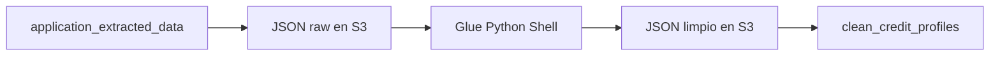
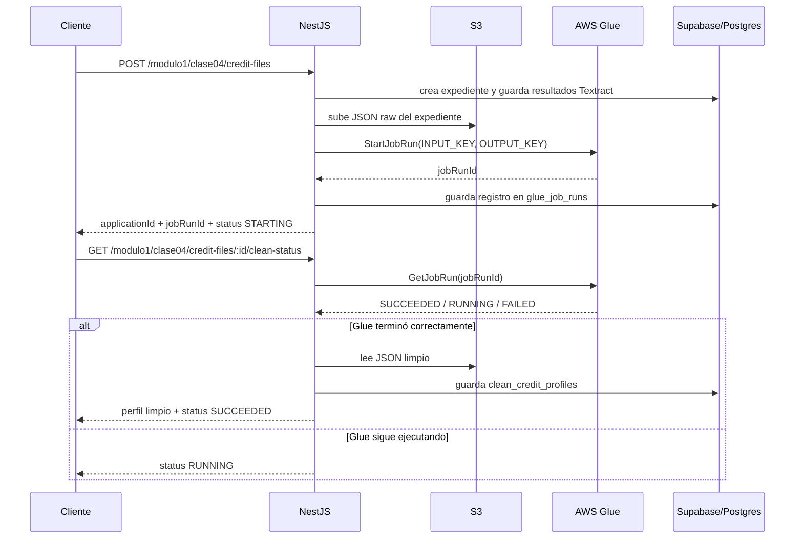
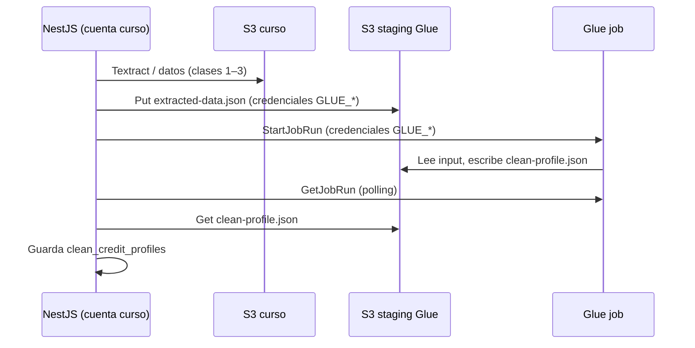

# Clase 4: AWS Glue para limpiar el expediente hipotecario

| | |
|---|---|
| **Clase** | 4 de 11 |
| **Duración** | 3 horas |
| **Controlador** | `Clase04Controller` |
| **Endpoints** | `POST /modulo1/clase04/credit-files`, `POST /modulo1/clase04/credit-files/clean`, `GET /modulo1/clase04/credit-files/:applicationId/clean-status` |

## Objetivos

Al terminar esta sesión podrás:

- Explicar por qué Glue se usa después de Textract.
- Crear un job de limpieza que normaliza datos del expediente.
- Convertir fechas, montos y textos a formatos consistentes.
- Guardar un perfil limpio del cliente en Postgres/Supabase.
- Usar un endpoint unificado para iniciar la limpieza de un file hipotecario.

---

## Parte teórica

### Qué problema resolvemos

En Clase 3 guardamos respuestas de Textract Queries. Esas respuestas todavía son texto:

```json
{
  "requested_amount": { "value": "Bs. 450.000", "confidence": 91.4 },
  "net_monthly_income": { "value": "8,500 bolivianos", "confidence": 88.2 }
}
```

Para Machine Learning necesitamos datos limpios:

```json
{
  "requested_amount": 450000,
  "net_monthly_income": 8500
}
```

### Qué es AWS Glue

AWS Glue es un servicio serverless de integración de datos. Se usa para descubrir, preparar, mover, limpiar y transformar datos que vienen de distintas fuentes. No es parte de NestJS ni de Postgres: es un servicio independiente que ejecuta jobs administrados por AWS.

La idea general es:

```txt
Fuente de datos -> Glue Job -> datos transformados -> destino
```

Glue puede trabajar con fuentes como:

| Fuente | Uso típico |
|--------|------------|
| Amazon S3 | Archivos JSON, CSV, Parquet, logs, datasets |
| Postgres / MySQL / SQL Server | Lectura y escritura vía JDBC |
| Redshift | Cargas analíticas |
| Data lakes | Preparación de datasets para Athena, EMR o ML |
| APIs o conectores | Integraciones según el conector disponible |

También tiene componentes que conviene diferenciar:

| Componente | Para qué sirve |
|------------|----------------|
| Glue Job | Ejecuta código de transformación. Puede ser Python Shell o Spark. |
| Glue Data Catalog | Catálogo central de tablas, esquemas y metadatos. |
| Glue Crawler | Inspecciona datos y crea/actualiza tablas en el catálogo. |
| Glue Connection | Guarda configuración de conexión a fuentes como JDBC o VPC. |
| Glue Studio | Interfaz visual para crear y monitorear jobs. |

En un proyecto real, Glue podría conectarse directamente a Postgres/Supabase por JDBC, leer tablas, transformar datos y escribir de vuelta en otra tabla. Para eso necesita credenciales, permisos y conectividad de red.

En esta clase usaremos un patrón más simple para laboratorio:

```txt
NestJS lee Postgres -> guarda JSON raw en S3 -> Glue limpia JSON -> guarda JSON limpio en S3 -> NestJS importa resultado a Postgres
```

Este patrón tiene ventajas didácticas:

- evita configurar JDBC y red privada desde el primer ejercicio;
- permite ver claramente el input y output del job;
- facilita depurar el script revisando archivos en S3;
- mantiene a NestJS como orquestador del flujo.

Más adelante, este mismo patrón puede evolucionar para que Glue lea y escriba directamente en la base de datos.

### Por qué usar Glue y no solo un script Python

Técnicamente, podríamos crear un script Python local que lea datos, limpie montos y fechas, y escriba el resultado. De hecho, en esta clase primero probaremos funciones locales para entender la lógica.

La diferencia es que un script local resuelve la limpieza, pero no resuelve tan bien la operación del proceso cuando empieza a crecer.

| Necesidad | Script Python local | AWS Glue |
|-----------|---------------------|----------|
| Ejecutar una prueba rápida | Muy cómodo | Más pesado |
| Procesar datos ocasionalmente | Suficiente | También posible |
| Ejecutar en la nube sin servidor propio | Requiere configurar servidor o contenedor | Serverless administrado |
| Manejar logs centralizados | Hay que implementarlo | CloudWatch Logs integrado |
| Reintentos, estado y seguimiento | Hay que programarlo | Job runs con estados como `RUNNING`, `SUCCEEDED`, `FAILED` |
| Escalar volumen | Depende de la máquina donde corre | Glue administra capacidad de ejecución |
| Integrarse con S3, IAM y otros servicios AWS | Hay que configurar manualmente | Integración nativa |
| Separar backend y procesamiento pesado | Hay que diseñarlo | Patrón natural con jobs |
| Trabajar con data lake o catálogo | No lo trae por defecto | Glue Data Catalog y Crawlers |

La ventaja de Glue no es que limpie mejor mágicamente. Las reglas de limpieza siguen siendo nuestras. La ventaja es que Glue convierte ese script en un proceso administrado:

```txt
script Python -> job monitoreable, parametrizable y ejecutable en AWS
```

En este curso usamos Glue porque queremos que el flujo se parezca a un pipeline real:

- NestJS no carga con toda la limpieza pesada.
- El backend puede lanzar un job y seguir funcionando.
- AWS registra cada ejecución con un `jobRunId`.
- Podemos revisar logs si algo falla.
- Podemos guardar inputs y outputs en S3.
- Más adelante podemos reutilizar los datos limpios para Machine Learning.

Para un ejercicio pequeño, un script local basta. Para un flujo de datos repetible, auditable y conectado a AWS, Glue tiene más sentido.

### Qué hará Glue

Glue será la capa de transformación:



Transformaciones:

| Transformación | Ejemplo |
|----------------|---------|
| Normalizar fechas | `15/05/2026` -> `2026-05-15` |
| Convertir montos | `Bs. 450.000` -> `450000` |
| Limpiar texto | espacios, símbolos, mayúsculas |
| Homologar campos | `ci`, `carnet`, `identity_number` -> `identity_number` |
| Variables derivadas | `estimated_monthly_payment`, `initial_debt_to_income_ratio` |

### Cómo se ejecuta Glue en nuestro flujo

En Glue hay dos conceptos importantes:

| Concepto | Qué significa |
|----------|---------------|
| Job | La definición del proceso: script, lenguaje, rol IAM, parámetros, capacidad de ejecución y configuración. |
| Job run | Una ejecución concreta de ese job. Cada vez que NestJS lanza Glue se crea un `jobRunId`. |

Piensa en el job como una receta y en el job run como una vez que ejecutas esa receta para un expediente específico.

En esta clase NestJS no espera a que Glue termine dentro del `POST`. El flujo es asíncrono:



La aplicación se entera de que Glue terminó porque consulta el estado del `jobRunId` con `GetJobRun`. Este patrón se llama **polling**: el cliente o el backend pregunta cada cierto tiempo si el proceso ya terminó.

Estados comunes de Glue:

| Estado | Qué significa |
|--------|---------------|
| `STARTING` | AWS está preparando la ejecución. |
| `RUNNING` | El script está ejecutándose. |
| `SUCCEEDED` | El job terminó correctamente. |
| `FAILED` | El job falló. Hay que revisar logs. |
| `STOPPED` | El job fue detenido manualmente. |
| `TIMEOUT` | El job superó el tiempo máximo configurado. |

En nuestro diseño:

- `POST /modulo1/clase04/credit-files` procesa Textract, lanza Glue y devuelve sin esperar a que Glue termine.
- Glue escribe el resultado limpio en S3.
- `GET /modulo1/clase04/credit-files/:applicationId/clean-status` consulta el job.
- Si el job está `SUCCEEDED`, NestJS lee el JSON limpio desde S3 y lo inserta en `clean_credit_profiles`.

Esto mantiene separadas las responsabilidades:

| Componente | Responsabilidad |
|------------|-----------------|
| NestJS | Orquestar, exponer endpoints, leer/escribir Supabase, lanzar Glue. |
| S3 | Guardar input raw y output limpio del job. |
| Glue | Ejecutar la limpieza y transformación. |
| Supabase/Postgres | Guardar estado, expediente y perfil limpio final. |

### Endpoint unificado

Desde esta clase tendremos un endpoint unificado:

```txt
POST /modulo1/clase04/credit-files
  -> registra expediente
  -> procesa documentos con Textract Queries
  -> lanza Glue
  -> devuelve applicationId y jobRunId
```

También conservamos un endpoint secundario para limpiar un expediente que ya fue creado y procesado en Clase 3:

```txt
POST /modulo1/clase04/credit-files/clean
```

---

## Parte práctica

### 1. Verifica Python

Antes de ir a AWS Glue, probaremos localmente las funciones de limpieza. Glue ejecutará Python, así que primero verifica que todos tengan Python instalado.

Windows:

```powershell
py --version
python --version
```

macOS:

```bash
python3 --version
```

Linux:

```bash
python3 --version
```

Usa Python 3.10 o superior. Si no lo tienes instalado:

- Windows: instala Python desde [python.org](https://www.python.org/downloads/) y marca la opción `Add Python to PATH`.
- macOS: usa el instalador de [python.org](https://www.python.org/downloads/) o Homebrew.
- Linux: instala desde el gestor de paquetes de tu distribución.

### 2. Crea scripts locales para probar limpieza

Primero probaremos funciones pequeñas. Esto evita subir el script a Glue por cada cambio.

Crea una carpeta local:

```bash
mkdir -p scripts/clase04
```

#### `clean_money`

Archivo: `scripts/clase04/test_clean_money.py`

```python
import re

def clean_money(value):
    # Si Textract no devolvió nada, no podemos limpiar el monto.
    if value is None:
        return None

    text = str(value).strip()

    # Validación mínima: si no hay ningún dígito, es una etiqueta
    # como "Saldo final", no un monto.
    if not re.search(r"\d", text):
        return None

    # Dejamos solo números, comas, puntos y signo negativo.
    # Esto elimina "Bs.", espacios y otros símbolos.
    text = re.sub(r"[^0-9,.-]", "", text)

    # Caso boliviano frecuente: "10.400,00".
    # El punto es separador de miles y la coma es decimal.
    if "," in text and "." in text:
        text = text.replace(".", "").replace(",", ".")
    elif "." in text:
        parts = text.split(".")
        # Si el último grupo tiene 3 dígitos, asumimos punto de miles:
        # "500.000" -> "500000".
        if len(parts[-1]) == 3:
            text = "".join(parts)
    elif "," in text:
        parts = text.split(",")
        # Si la parte final tiene 2 dígitos, asumimos coma decimal:
        # "10400,00" -> "10400.00".
        if len(parts[-1]) == 2:
            text = "".join(parts[:-1]) + "." + parts[-1]
        else:
            text = "".join(parts)

    try:
        # Si después de limpiar queda un número válido, lo convertimos.
        return round(float(text), 2)
    except ValueError:
        # Si el texto sigue sin ser convertible, lo marcamos como faltante.
        return None

tests = [
    "Bs. 12.500",
    "Bs. 10.400,00",
    "12.500,00",
    "Bs. 2.100,00",
    "Bs. 18.700,00",
    "Bs. 14.450,00",
    "Bs. 500.000",
    "Bs. 185.000",
    "Saldo final",
    None,
]

for item in tests:
    print(f"{item!r} -> {clean_money(item)}")
```

Ejecuta:

```bash
python3 scripts/clase04/test_clean_money.py
```

En Windows, si `python3` no existe:

```powershell
py scripts/clase04/test_clean_money.py
```

#### `clean_date`

Archivo: `scripts/clase04/test_clean_date.py`

```python
import re
from datetime import datetime

MONTHS = {
    "enero": "01",
    "febrero": "02",
    "marzo": "03",
    "abril": "04",
    "mayo": "05",
    "junio": "06",
    "unio": "06",
    "julio": "07",
    "agosto": "08",
    "septiembre": "09",
    "setiembre": "09",
    "octubre": "10",
    "noviembre": "11",
    "diciembre": "12",
}

def clean_date(value):
    # Si el campo no existe o fue descartado por confianza, no hay fecha.
    if value is None:
        return None

    text = str(value).strip().lower()

    # Primero probamos formatos numéricos comunes.
    for fmt in ("%d/%m/%Y", "%Y-%m-%d", "%d-%m-%Y"):
        try:
            return datetime.strptime(text, fmt).date().isoformat()
        except ValueError:
            pass

    # Luego probamos fechas textuales en español:
    # "12 de Febrero de 1983".
    match = re.search(r"(\d{1,2})\s+de\s+([a-záéíóúñ]+)\s+de\s+(\d{4})", text)
    if match:
        day, month_name, year = match.groups()
        month = MONTHS.get(month_name)
        if month:
            return f"{year}-{month}-{int(day):02d}"

    # Si no reconocemos el formato, dejamos el campo como faltante.
    return None

tests = [
    "12 de Febrero de 1983",
    "2 de unio de 2031",
    "15/05/2026",
    "2026-05-15",
    None,
]

for item in tests:
    print(f"{item!r} -> {clean_date(item)}")
```

#### `clean_bool` y `clean_months`

Archivo: `scripts/clase04/test_clean_bool_and_months.py`

```python
import re

def clean_bool(value):
    # Si no hay valor, no asumimos verdadero ni falso.
    if value is None:
        return None

    text = str(value).strip().lower()

    # Negaciones directas.
    if text in ["no", "false", "falso"]:
        return False

    # Frases negativas que contienen palabras como "mora".
    # Deben evaluarse antes de buscar la palabra "mora".
    if any(phrase in text for phrase in ["sin mora", "sin atraso", "no registra mora"]):
        return False

    # Afirmaciones directas.
    if text in ["si", "sí", "yes", "true", "verdadero"]:
        return True

    # Si aparece mora, atraso o default sin negación, lo tratamos como riesgo.
    if any(word in text for word in ["mora", "vencido", "atraso", "default"]):
        return True

    # Si no podemos inferirlo, no inventamos un booleano.
    return None

def clean_months(value):
    # El plazo puede venir como "240 meses", "20 años" o mixto.
    if value is None:
        return None

    text = str(value).lower()

    # Priorizamos el número entre paréntesis porque suele ser el dato exacto:
    # "20 anos (240 meses)" -> 240.
    match = re.search(r"\((\d+)\s*mes", text)
    if match:
        return int(match.group(1))

    # Si viene en años, lo convertimos a meses.
    years = re.search(r"(\d+)\s*(anos|años|anios|years)", text)
    if years:
        return int(years.group(1)) * 12

    # Si ya viene en meses, usamos ese número.
    months = re.search(r"(\d+)\s*(mes|meses|months)", text)
    if months:
        return int(months.group(1))

    # Si no detectamos plazo, lo dejamos faltante.
    return None

print("clean_bool")
for item in ["No", "Sí", "Tiene mora", "Sin mora", None]:
    print(f"{item!r} -> {clean_bool(item)}")

print("\nclean_months")
for item in ["20 anos (240 meses)", "5 años", "18 meses", None]:
    print(f"{item!r} -> {clean_months(item)}")
```

#### `get_value` con umbral de confianza

Archivo: `scripts/clase04/test_get_value.py`

```python
def get_value(section, alias, threshold=80):
    # Busca un campo dentro de una sección del expediente limpio por Clase 3.
    item = (section or {}).get(alias)

    # Si el campo viene con value/confidence, aplicamos umbral.
    if isinstance(item, dict):
        if float(item.get("confidence") or 0) < threshold:
            # La respuesta existe, pero no es suficientemente confiable.
            return None
        return item.get("value")

    # Si ya era un valor simple, lo devolvemos tal cual.
    return item

employment = {
    "employee_name": {"value": "JAIME RONNY RIVERA ROJAS", "confidence": 88},
    "employer_name": {"value": "Tecnologias Integrales del Sur S.R.L", "confidence": 49},
    "declared_salary": {"value": "Bs. 12.500", "confidence": 50},
}

for field in ["employee_name", "employer_name", "declared_salary"]:
    print(f"{field} -> {get_value(employment, field)}")
```

Observa que con umbral `80`, `employer_name` y `declared_salary` quedan en `None`. Eso no significa que el dato no exista, sino que su confianza es baja. En un sistema real podríamos mandarlo a revisión o bajar el umbral para ciertos campos.

### 3. AWS Glue en cuenta compartida (solo formador)

La cuenta demo del curso (`980921750553`) **no puede crear jobs Glue** (bloqueo a nivel de cuenta AWS). Por eso el **formador** creó el job en otra cuenta AWS (`008428747157`).

**Tú (alumno) no creas el job en consola.** Solo conectas NestJS a esa cuenta con credenciales que te entregará el formador.

#### Dos cuentas AWS en esta clase

| Cuenta | Para qué | Credenciales en `.env` |
|--------|----------|-------------------------|
| **Curso** (`980921750553`) | Textract, S3 de documentos, Postgres | `AWS_ACCESS_KEY_ID`, `AWS_SECRET_ACCESS_KEY`, `AWS_S3_BUCKET` |
| **Glue** (`008428747157`) | Job `clean-mortgage-credit-file`, bucket staging | `GLUE_AWS_ACCESS_KEY_ID`, `GLUE_AWS_SECRET_ACCESS_KEY` |

#### Bucket staging (cuenta Glue)

ARN: `arn:aws:s3:::curso-glue-staging-008428747157-us-east-1`

Cada equipo tiene su carpeta:

| Usuario cuenta curso | Variable `AWS_GLUE_STAGING_PREFIX` | Carpeta en S3 |
|----------------------|-----------------------------------|---------------|
| `docente` | `docente` | `docente/{applicationId}/` |
| `grupo1` | `grupo1` | `grupo1/{applicationId}/` |
| `grupo2` | `grupo2` | `grupo2/{applicationId}/` |
| `grupo3` | `grupo3` | `grupo3/{applicationId}/` |
| `grupo4` | `grupo4` | `grupo4/{applicationId}/` |

NestJS sube `extracted-data.json` ahí, Glue escribe `clean-profile.json`, y NestJS importa el resultado a Postgres.

#### Flujo NestJS ↔ Glue (sin consola)



El script Python del job es el mismo que probaste localmente; el formador ya lo subió al job `clean-mortgage-credit-file`.

> **Solo formador:** job en Glue Studio (Python Shell), bucket `curso-glue-staging-008428747157-us-east-1`, usuario IAM invocador compartido. Detalle de setup en `guia-docente.md`.

El script del job (referencia; ya está desplegado):

```python
import json
import re
import sys
from datetime import datetime
import boto3
from awsglue.utils import getResolvedOptions

args = getResolvedOptions(
    sys.argv,
    ["BUCKET", "APPLICATION_ID", "INPUT_KEY", "OUTPUT_KEY", "CONFIDENCE_THRESHOLD"],
)

s3 = boto3.client("s3")
threshold = float(args["CONFIDENCE_THRESHOLD"])

MONTHS = {
    "enero": "01",
    "febrero": "02",
    "marzo": "03",
    "abril": "04",
    "mayo": "05",
    "junio": "06",
    "unio": "06",
    "julio": "07",
    "agosto": "08",
    "septiembre": "09",
    "setiembre": "09",
    "octubre": "10",
    "noviembre": "11",
    "diciembre": "12",
}

def read_json(bucket, key):
    obj = s3.get_object(Bucket=bucket, Key=key)
    return json.loads(obj["Body"].read().decode("utf-8"))

def write_json(bucket, key, data):
    s3.put_object(
        Bucket=bucket,
        Key=key,
        Body=json.dumps(data, ensure_ascii=False, indent=2).encode("utf-8"),
        ContentType="application/json",
    )

def get_value(section, alias):
    # Busca un campo por alias dentro de una sección del JSON.
    item = (section or {}).get(alias)

    # Si viene con confianza, descartamos respuestas débiles.
    if isinstance(item, dict):
        if float(item.get("confidence") or 0) < threshold:
            return None
        return item.get("value")

    # Si ya es valor simple, se devuelve sin validación adicional.
    return item

def clean_money(value):
    # No hay monto para limpiar.
    if value is None:
        return None

    text = str(value).strip()

    # Si no hay dígitos, probablemente es una etiqueta como "Saldo final".
    if not re.search(r"\d", text):
        return None

    # Quitamos moneda y símbolos, pero mantenemos separadores numéricos.
    text = re.sub(r"[^0-9,.-]", "", text)

    # Formato "10.400,00": punto de miles, coma decimal.
    if "," in text and "." in text:
        text = text.replace(".", "").replace(",", ".")
    elif "." in text:
        parts = text.split(".")
        # Formato "500.000": punto de miles sin decimales.
        if len(parts[-1]) == 3:
            text = "".join(parts)
    elif "," in text:
        parts = text.split(",")
        # Formato "10400,00": coma decimal.
        if len(parts[-1]) == 2:
            text = "".join(parts[:-1]) + "." + parts[-1]
        else:
            text = "".join(parts)

    try:
        # Si el texto final es numérico, lo convertimos a decimal.
        return round(float(text), 2)
    except ValueError:
        # Si no se puede convertir, se reportará como faltante.
        return None

def clean_int(value):
    # Extrae el primer número entero que aparezca en el texto.
    if value is None:
        return None
    match = re.search(r"\d+", str(value))
    return int(match.group()) if match else None

def clean_months(value):
    # Convierte plazos de texto a cantidad de meses.
    if value is None:
        return None

    text = str(value).lower()

    # Si aparece "(240 meses)", usamos ese dato porque suele ser exacto.
    match = re.search(r"\((\d+)\s*mes", text)
    if match:
        return int(match.group(1))

    # Si está en años, lo llevamos a meses.
    years = re.search(r"(\d+)\s*(anos|años|anios|years)", text)
    if years:
        return int(years.group(1)) * 12

    # Si ya está en meses, usamos el número directamente.
    months = re.search(r"(\d+)\s*(mes|meses|months)", text)
    if months:
        return int(months.group(1))

    return None

def clean_bool(value):
    # Convierte respuestas textuales a booleano.
    if value is None:
        return None

    text = str(value).strip().lower()

    # Negaciones explícitas.
    if text in ["no", "false", "falso"]:
        return False

    # Frases negativas que contienen palabras de riesgo.
    if any(phrase in text for phrase in ["sin mora", "sin atraso", "no registra mora"]):
        return False

    # Afirmaciones explícitas.
    if text in ["si", "sí", "yes", "true", "verdadero"]:
        return True

    # Palabras que indican mora o incumplimiento.
    if any(word in text for word in ["mora", "vencido", "atraso", "default"]):
        return True

    # Si no se puede interpretar, queda faltante.
    return None

def clean_date(value):
    # Convierte fechas a ISO: YYYY-MM-DD.
    if value is None:
        return None

    text = str(value).strip().lower()

    # Probamos formatos numéricos comunes.
    for fmt in ("%d/%m/%Y", "%Y-%m-%d", "%d-%m-%Y"):
        try:
            return datetime.strptime(text, fmt).date().isoformat()
        except ValueError:
            pass

    # Probamos fechas textuales en español.
    match = re.search(r"(\d{1,2})\s+de\s+([a-záéíóúñ]+)\s+de\s+(\d{4})", text)
    if match:
        day, month_name, year = match.groups()
        month = MONTHS.get(month_name)
        if month:
            return f"{year}-{month}-{int(day):02d}"

    # Si no reconocemos el formato, queda faltante.
    return None

raw = read_json(args["BUCKET"], args["INPUT_KEY"])

personal = raw.get("personalData", {})
employment = raw.get("employmentData", {})
income = raw.get("incomeData", {})
banking = raw.get("bankingData", {})
loan = raw.get("loanRequestData", {})
credit = raw.get("creditHistoryData", {})

net_income = clean_money(get_value(income, "net_monthly_income"))
monthly_debt = clean_money(get_value(credit, "monthly_debt_payment"))
requested_amount = clean_money(get_value(loan, "requested_amount"))
term_months = clean_months(get_value(loan, "requested_term_months")) or 240
estimated_payment = round(requested_amount / term_months, 2) if requested_amount else None

clean = {
    "application_id": args["APPLICATION_ID"],
    "applicant_name": get_value(personal, "full_name") or get_value(employment, "employee_name"),
    "identity_number": get_value(personal, "identity_number"),
    "birth_date": clean_date(get_value(personal, "birth_date")),
    "employer_name": get_value(employment, "employer_name"),
    "job_title": get_value(employment, "job_title"),
    "employment_tenure_months": clean_months(get_value(employment, "employment_tenure")),
    "net_monthly_income": net_income,
    "gross_monthly_income": clean_money(get_value(income, "gross_monthly_income")),
    "average_monthly_balance": clean_money(get_value(banking, "average_monthly_balance")),
    "requested_amount": requested_amount,
    "requested_term_months": term_months,
    "property_value": clean_money(get_value(loan, "property_value")),
    "reported_total_debt": clean_money(get_value(credit, "reported_total_debt")),
    "monthly_debt_payment": monthly_debt,
    "active_loan_count": clean_int(get_value(credit, "active_loan_count")),
    "has_late_payments": clean_bool(get_value(credit, "has_late_payments")),
    "estimated_monthly_payment": estimated_payment,
    "initial_debt_to_income_ratio": round(monthly_debt / net_income, 4) if net_income and monthly_debt is not None else None,
}

quality = {
    "missing_fields": [key for key, value in clean.items() if value is None],
    "confidence_threshold": threshold,
}

write_json(args["BUCKET"], args["OUTPUT_KEY"], {
    "clean": clean,
    "quality_report": quality,
})
```

Para probarlo manualmente (solo formador, consola Glue), parámetros de ejemplo:

```txt
--BUCKET=curso-glue-staging-008428747157-us-east-1
--APPLICATION_ID=APPLICATION_ID
--INPUT_KEY=docente/APPLICATION_ID/extracted-data.json
--OUTPUT_KEY=docente/APPLICATION_ID/clean-profile.json
--CONFIDENCE_THRESHOLD=80
```

Cambia `docente` por tu `AWS_GLUE_STAGING_PREFIX` (`grupo1`, etc.).

Luego revisa:

- estado del job en Glue (cuenta `008428747157`);
- logs en CloudWatch si falla;
- archivo `clean-profile.json` en el bucket staging si termina correctamente.

### 4. Instala Glue SDK y variables en NestJS

NestJS usa **dos cuentas**: credenciales del curso (Textract/S3) y credenciales Glue (staging + job). No reescribes el script Python; NestJS sube el JSON al staging, lanza el job y consulta el estado.

```bash
npm install @aws-sdk/client-glue @aws-sdk/client-s3
```

Agrega a `.env` (mantén las variables de clases anteriores y añade las de Glue):

```env
# Cuenta curso (980921750553) — sin cambios
AWS_REGION=us-east-1
AWS_ACCESS_KEY_ID=
AWS_SECRET_ACCESS_KEY=
AWS_S3_BUCKET=docente-980921750553-us-east-1-an

# Cuenta Glue (008428747157) — te las entrega el formador
GLUE_AWS_ACCESS_KEY_ID=
GLUE_AWS_SECRET_ACCESS_KEY=
AWS_GLUE_REGION=us-east-1
AWS_GLUE_CLEAN_JOB_NAME=clean-mortgage-credit-file
AWS_GLUE_STAGING_BUCKET=curso-glue-staging-008428747157-us-east-1
AWS_GLUE_STAGING_PREFIX=docente
```

| Variable | Descripción |
|----------|-------------|
| `GLUE_AWS_*` | Access key del usuario invocador (cuenta Glue) |
| `AWS_GLUE_STAGING_BUCKET` | Bucket staging: `curso-glue-staging-008428747157-us-east-1` |
| `AWS_GLUE_STAGING_PREFIX` | Tu carpeta: `docente`, `grupo1`, `grupo2`, `grupo3` o `grupo4` |
| `AWS_GLUE_CLEAN_JOB_NAME` | Siempre `clean-mortgage-credit-file` |

### 5. Crea la migración

```bash
npx typeorm-ts-node-commonjs migration:create src/migrations/CreateCleanCreditProfiles
```

Reemplaza el contenido, conservando el nombre de clase generado:

```typescript
import { MigrationInterface, QueryRunner } from 'typeorm';

export class CreateCleanCreditProfiles1780000000001
  implements MigrationInterface
{
  name = 'CreateCleanCreditProfiles1780000000001';

  public async up(queryRunner: QueryRunner): Promise<void> {
    const schema = process.env.DATABASE_SCHEMA ?? 'public';
    const q = `"${schema}"`;

    await queryRunner.query(`
      CREATE TABLE ${q}."clean_credit_profiles" (
        "id" uuid PRIMARY KEY DEFAULT gen_random_uuid(),
        "application_id" uuid NOT NULL UNIQUE,
        "applicant_name" text,
        "identity_number" text,
        "birth_date" date,
        "employer_name" text,
        "job_title" text,
        "employment_tenure_months" integer,
        "net_monthly_income" numeric(14,2),
        "gross_monthly_income" numeric(14,2),
        "average_monthly_balance" numeric(14,2),
        "requested_amount" numeric(14,2),
        "requested_term_months" integer,
        "property_value" numeric(14,2),
        "reported_total_debt" numeric(14,2),
        "monthly_debt_payment" numeric(14,2),
        "active_loan_count" integer,
        "has_late_payments" boolean,
        "estimated_monthly_payment" numeric(14,2),
        "initial_debt_to_income_ratio" numeric(8,4),
        "clean_payload" jsonb NOT NULL DEFAULT '{}'::jsonb,
        "quality_report" jsonb NOT NULL DEFAULT '{}'::jsonb,
        "created_at" timestamptz NOT NULL DEFAULT now(),
        "updated_at" timestamptz NOT NULL DEFAULT now(),
        CONSTRAINT "FK_clean_credit_profiles_application"
          FOREIGN KEY ("application_id") REFERENCES ${q}."credit_applications"("id")
      )
    `);

    await queryRunner.query(`
      CREATE TABLE ${q}."glue_job_runs" (
        "id" uuid PRIMARY KEY DEFAULT gen_random_uuid(),
        "application_id" uuid NOT NULL,
        "job_name" text NOT NULL,
        "job_run_id" text NOT NULL,
        "job_type" text NOT NULL,
        "status" text NOT NULL DEFAULT 'STARTING',
        "input_path" text,
        "output_path" text,
        "created_at" timestamptz NOT NULL DEFAULT now(),
        "updated_at" timestamptz NOT NULL DEFAULT now(),
        CONSTRAINT "FK_glue_job_runs_application"
          FOREIGN KEY ("application_id") REFERENCES ${q}."credit_applications"("id")
      )
    `);
  }

  public async down(queryRunner: QueryRunner): Promise<void> {
    const schema = process.env.DATABASE_SCHEMA ?? 'public';
    const q = `"${schema}"`;
    await queryRunner.query(`DROP TABLE IF EXISTS ${q}."glue_job_runs"`);
    await queryRunner.query(`DROP TABLE IF EXISTS ${q}."clean_credit_profiles"`);
  }
}
```

Ejecuta:

```bash
npm run migration:run
```

### 6. Crea las entidades

Archivo: `src/entities/clean-credit-profile.entity.ts`

```typescript
import {
  Column,
  CreateDateColumn,
  Entity,
  PrimaryGeneratedColumn,
  UpdateDateColumn,
} from 'typeorm';

@Entity({ name: 'clean_credit_profiles' })
export class CleanCreditProfile {
  @PrimaryGeneratedColumn('uuid')
  id: string;

  @Column({ name: 'application_id', type: 'uuid', unique: true })
  applicationId: string;

  @Column({ name: 'applicant_name', type: 'text', nullable: true })
  applicantName?: string;

  @Column({ name: 'identity_number', type: 'text', nullable: true })
  identityNumber?: string;

  @Column({ name: 'birth_date', type: 'date', nullable: true })
  birthDate?: string;

  @Column({ name: 'employer_name', type: 'text', nullable: true })
  employerName?: string;

  @Column({ name: 'job_title', type: 'text', nullable: true })
  jobTitle?: string;

  @Column({ name: 'employment_tenure_months', type: 'integer', nullable: true })
  employmentTenureMonths?: number;

  @Column({ name: 'net_monthly_income', type: 'numeric', nullable: true })
  netMonthlyIncome?: number;

  @Column({ name: 'gross_monthly_income', type: 'numeric', nullable: true })
  grossMonthlyIncome?: number;

  @Column({ name: 'average_monthly_balance', type: 'numeric', nullable: true })
  averageMonthlyBalance?: number;

  @Column({ name: 'requested_amount', type: 'numeric', nullable: true })
  requestedAmount?: number;

  @Column({ name: 'requested_term_months', type: 'integer', nullable: true })
  requestedTermMonths?: number;

  @Column({ name: 'property_value', type: 'numeric', nullable: true })
  propertyValue?: number;

  @Column({ name: 'reported_total_debt', type: 'numeric', nullable: true })
  reportedTotalDebt?: number;

  @Column({ name: 'monthly_debt_payment', type: 'numeric', nullable: true })
  monthlyDebtPayment?: number;

  @Column({ name: 'active_loan_count', type: 'integer', nullable: true })
  activeLoanCount?: number;

  @Column({ name: 'has_late_payments', type: 'boolean', nullable: true })
  hasLatePayments?: boolean;

  @Column({ name: 'estimated_monthly_payment', type: 'numeric', nullable: true })
  estimatedMonthlyPayment?: number;

  @Column({ name: 'initial_debt_to_income_ratio', type: 'numeric', nullable: true })
  initialDebtToIncomeRatio?: number;

  @Column({ name: 'clean_payload', type: 'jsonb', default: {} })
  cleanPayload: Record<string, unknown>;

  @Column({ name: 'quality_report', type: 'jsonb', default: {} })
  qualityReport: Record<string, unknown>;

  @CreateDateColumn({ name: 'created_at', type: 'timestamptz' })
  createdAt: Date;

  @UpdateDateColumn({ name: 'updated_at', type: 'timestamptz' })
  updatedAt: Date;
}
```

Archivo: `src/entities/glue-job-run.entity.ts`

```typescript
import {
  Column,
  CreateDateColumn,
  Entity,
  PrimaryGeneratedColumn,
  UpdateDateColumn,
} from 'typeorm';

@Entity({ name: 'glue_job_runs' })
export class GlueJobRunEntity {
  @PrimaryGeneratedColumn('uuid')
  id: string;

  @Column({ name: 'application_id', type: 'uuid' })
  applicationId: string;

  @Column({ name: 'job_name', type: 'text' })
  jobName: string;

  @Column({ name: 'job_run_id', type: 'text' })
  jobRunId: string;

  @Column({ name: 'job_type', type: 'text' })
  jobType: string;

  @Column({ type: 'text', default: 'STARTING' })
  status: string;

  @Column({ name: 'input_path', type: 'text', nullable: true })
  inputPath?: string;

  @Column({ name: 'output_path', type: 'text', nullable: true })
  outputPath?: string;

  @CreateDateColumn({ name: 'created_at', type: 'timestamptz' })
  createdAt: Date;

  @UpdateDateColumn({ name: 'updated_at', type: 'timestamptz' })
  updatedAt: Date;
}
```

### 7. Crea `GlueService`

Archivo: `src/modulo1/clase04/glue.service.ts`

```typescript
import { Injectable } from '@nestjs/common';
import { ConfigService } from '@nestjs/config';
import {
  GetJobRunCommand,
  GlueClient,
  StartJobRunCommand,
} from '@aws-sdk/client-glue';

@Injectable()
export class GlueService {
  private readonly client: GlueClient;

  constructor(private readonly config: ConfigService) {
    this.client = new GlueClient({
      region: this.config.getOrThrow<string>('AWS_GLUE_REGION'),
      credentials: {
        accessKeyId: this.config.getOrThrow<string>('GLUE_AWS_ACCESS_KEY_ID'),
        secretAccessKey: this.config.getOrThrow<string>(
          'GLUE_AWS_SECRET_ACCESS_KEY',
        ),
      },
    });
  }

  async startCleanJob(args: {
    applicationId: string;
    inputKey: string;
    outputKey: string;
  }) {
    const jobName = this.config.getOrThrow<string>('AWS_GLUE_CLEAN_JOB_NAME');
    const stagingBucket = this.config.getOrThrow<string>(
      'AWS_GLUE_STAGING_BUCKET',
    );

    const command = new StartJobRunCommand({
      JobName: jobName,
      Arguments: {
        '--BUCKET': stagingBucket,
        '--APPLICATION_ID': args.applicationId,
        '--INPUT_KEY': args.inputKey,
        '--OUTPUT_KEY': args.outputKey,
        '--CONFIDENCE_THRESHOLD': '80',
      },
    });

    const response = await this.client.send(command);
    return {
      jobName,
      jobRunId: response.JobRunId!,
    };
  }

  async getJobStatus(jobName: string, jobRunId: string) {
    const response = await this.client.send(
      new GetJobRunCommand({
        JobName: jobName,
        RunId: jobRunId,
        PredecessorsIncluded: false,
      }),
    );

    return response.JobRun?.JobRunState ?? 'UNKNOWN';
  }
}
```

### 8. Crea `Clase04Service`

Archivo: `src/modulo1/clase04/clase04.service.ts`

```typescript
import {
  BadRequestException,
  Injectable,
  NotFoundException,
} from '@nestjs/common';
import { ConfigService } from '@nestjs/config';
import { GetObjectCommand, PutObjectCommand, S3Client } from '@aws-sdk/client-s3';
import { InjectRepository } from '@nestjs/typeorm';
import { Repository } from 'typeorm';
import { ApplicationExtractedData } from '../../entities/application-extracted-data.entity';
import { CleanCreditProfile } from '../../entities/clean-credit-profile.entity';
import { GlueJobRunEntity } from '../../entities/glue-job-run.entity';
import { Clase03Service } from '../clase03/clase03.service';
import { GlueService } from './glue.service';

type CreateAndCleanCreditFileBody = {
  applicantExternalId?: string;
  applicantName?: string;
  documents: {
    documentType: string;
    fileName: string;
  }[];
};

@Injectable()
export class Clase04Service {
  private readonly glueS3: S3Client;

  constructor(
    private readonly config: ConfigService,
    private readonly glue: GlueService,
    private readonly clase03: Clase03Service,
    @InjectRepository(ApplicationExtractedData)
    private readonly extractedData: Repository<ApplicationExtractedData>,
    @InjectRepository(CleanCreditProfile)
    private readonly cleanProfiles: Repository<CleanCreditProfile>,
    @InjectRepository(GlueJobRunEntity)
    private readonly glueRuns: Repository<GlueJobRunEntity>,
  ) {
    this.glueS3 = new S3Client({
      region: this.config.getOrThrow<string>('AWS_GLUE_REGION'),
      credentials: {
        accessKeyId: this.config.getOrThrow<string>('GLUE_AWS_ACCESS_KEY_ID'),
        secretAccessKey: this.config.getOrThrow<string>(
          'GLUE_AWS_SECRET_ACCESS_KEY',
        ),
      },
    });
  }

  async createProcessAndCleanCreditFile(body: CreateAndCleanCreditFileBody) {
    const creditFile = await this.clase03.createCreditFile(body);
    await this.clase03.processCreditFile(creditFile.applicationId);
    const cleanJob = await this.cleanCreditFile({
      applicationId: creditFile.applicationId,
    });

    return {
      applicationId: creditFile.applicationId,
      textractStatus: 'TEXTRACT_COMPLETED',
      cleanJob,
    };
  }

  async cleanCreditFile(body: { applicationId: string }) {
    const extracted = await this.extractedData.findOne({
      where: { applicationId: body.applicationId },
    });

    if (!extracted) {
      throw new BadRequestException('Run Clase 3 before cleaning this file');
    }

    const inputKey = this.stagingKey(
      body.applicationId,
      'extracted-data.json',
    );
    const outputKey = this.stagingKey(body.applicationId, 'clean-profile.json');

    await this.uploadStagingJson(inputKey, {
      personalData: extracted.personalData,
      employmentData: extracted.employmentData,
      incomeData: extracted.incomeData,
      bankingData: extracted.bankingData,
      loanRequestData: extracted.loanRequestData,
      creditHistoryData: extracted.creditHistoryData,
      confidenceSummary: extracted.confidenceSummary,
    });

    const job = await this.glue.startCleanJob({
      applicationId: body.applicationId,
      inputKey,
      outputKey,
    });

    const run = await this.glueRuns.save(
      this.glueRuns.create({
        applicationId: body.applicationId,
        jobName: job.jobName,
        jobRunId: job.jobRunId,
        jobType: 'CLEAN_CREDIT_FILE',
        status: 'STARTING',
        inputPath: inputKey,
        outputPath: outputKey,
      }),
    );

    return {
      applicationId: body.applicationId,
      jobRunId: run.jobRunId,
      status: run.status,
      stagingBucket: this.config.getOrThrow<string>('AWS_GLUE_STAGING_BUCKET'),
      inputKey,
      outputKey,
    };
  }

  async getCleanStatus(applicationId: string) {
    const run = await this.glueRuns.findOne({
      where: { applicationId, jobType: 'CLEAN_CREDIT_FILE' },
      order: { createdAt: 'DESC' },
    });

    if (!run) {
      throw new NotFoundException('No clean job found for this application');
    }

    const status = await this.glue.getJobStatus(run.jobName, run.jobRunId);
    await this.glueRuns.update(run.id, { status });

    if (status === 'SUCCEEDED') {
      await this.importCleanProfile(applicationId, run.outputPath!);
    }

    const profile = await this.cleanProfiles.findOne({ where: { applicationId } });

    return {
      applicationId,
      jobRunId: run.jobRunId,
      status,
      cleanProfile: profile,
    };
  }

  private stagingKey(applicationId: string, fileName: string) {
    const prefix = this.config.getOrThrow<string>('AWS_GLUE_STAGING_PREFIX');
    return `${prefix}/${applicationId}/${fileName}`;
  }

  private async uploadStagingJson(key: string, data: unknown) {
    await this.glueS3.send(
      new PutObjectCommand({
        Bucket: this.config.getOrThrow<string>('AWS_GLUE_STAGING_BUCKET'),
        Key: key,
        Body: JSON.stringify(data),
        ContentType: 'application/json',
      }),
    );
  }

  private async importCleanProfile(applicationId: string, key: string) {
    const response = await this.glueS3.send(
      new GetObjectCommand({
        Bucket: this.config.getOrThrow<string>('AWS_GLUE_STAGING_BUCKET'),
        Key: key,
      }),
    );

    const text = await response.Body!.transformToString();
    const payload = JSON.parse(text);
    const clean = payload.clean;

    const existing = await this.cleanProfiles.findOne({ where: { applicationId } });

    await this.cleanProfiles.save(
      this.cleanProfiles.create({
        ...(existing ?? {}),
        applicationId,
        applicantName: clean.applicant_name,
        identityNumber: clean.identity_number,
        birthDate: clean.birth_date,
        employerName: clean.employer_name,
        jobTitle: clean.job_title,
        employmentTenureMonths: clean.employment_tenure_months,
        netMonthlyIncome: clean.net_monthly_income,
        grossMonthlyIncome: clean.gross_monthly_income,
        averageMonthlyBalance: clean.average_monthly_balance,
        requestedAmount: clean.requested_amount,
        requestedTermMonths: clean.requested_term_months,
        propertyValue: clean.property_value,
        reportedTotalDebt: clean.reported_total_debt,
        monthlyDebtPayment: clean.monthly_debt_payment,
        activeLoanCount: clean.active_loan_count,
        hasLatePayments: clean.has_late_payments,
        estimatedMonthlyPayment: clean.estimated_monthly_payment,
        initialDebtToIncomeRatio: clean.initial_debt_to_income_ratio,
        cleanPayload: clean,
        qualityReport: payload.quality_report,
      }),
    );
  }
}
```

### 9. Crea el controller

Archivo: `src/modulo1/clase04/clase04.controller.ts`

```typescript
import { Body, Controller, Get, Param, Post, UseGuards } from '@nestjs/common';
import { ApiKeyGuard } from '../../auth/guards/api-key.guard';
import { Clase04Service } from './clase04.service';

@Controller('modulo1/clase04')
@UseGuards(ApiKeyGuard)
export class Clase04Controller {
  constructor(private readonly clase04: Clase04Service) {}

  @Post('credit-files')
  async createProcessAndCleanCreditFile(
    @Body()
    body: {
      applicantExternalId?: string;
      applicantName?: string;
      documents: { documentType: string; fileName: string }[];
    },
  ) {
    return await this.clase04.createProcessAndCleanCreditFile(body);
  }

  @Post('credit-files/clean')
  async cleanCreditFile(@Body() body: { applicationId: string }) {
    return await this.clase04.cleanCreditFile(body);
  }

  @Get('credit-files/:applicationId/clean-status')
  async getCleanStatus(@Param('applicationId') applicationId: string) {
    return await this.clase04.getCleanStatus(applicationId);
  }
}
```

### 10. Actualiza `Modulo1Module`

Agrega:

```typescript
import { CleanCreditProfile } from '../entities/clean-credit-profile.entity';
import { GlueJobRunEntity } from '../entities/glue-job-run.entity';
import { Clase04Controller } from './clase04/clase04.controller';
import { Clase04Service } from './clase04/clase04.service';
import { GlueService } from './clase04/glue.service';
```

Incluye las entidades en `TypeOrmModule.forFeature([...])`, el controller en `controllers` y los services en `providers`.

Mantén también registrados `Clase03Service` y sus entidades, porque `Clase04Service` reutiliza la creación y procesamiento del expediente de la clase anterior.

```typescript
TypeOrmModule.forFeature([
  RawDocumentText,
  CreditApplication,
  ApplicationDocument,
  DocumentType,
  TextractResult,
  TextractQueryAnswer,
  ApplicationExtractedData,
  CleanCreditProfile,
  GlueJobRunEntity,
])
```

### 11. Prueba

#### Endpoint unificado

```bash
curl -X POST http://localhost:3000/modulo1/clase04/credit-files \
  -H "Content-Type: application/json" \
  -H "x-api-key: test1" \
  -H "x-api-secret: pass1" \
  -d '{
    "applicantExternalId": "CLI-001",
    "applicantName": "Cliente Demo",
    "documents": [
      { "documentType": "CARNET_IDENTIDAD_BOLIVIANO", "fileName": "cliente-001/carnet.jpg" },
      { "documentType": "CERTIFICADO_TRABAJO", "fileName": "cliente-001/certificado-trabajo.pdf" },
      { "documentType": "BOLETA_PAGO", "fileName": "cliente-001/boleta-pago-01.pdf" },
      { "documentType": "EXTRACTO_BANCARIO", "fileName": "cliente-001/extracto-bancario.pdf" },
      { "documentType": "FORMULARIO_SOLICITUD_CREDITO", "fileName": "cliente-001/solicitud.pdf" },
      { "documentType": "REPORTE_CREDITICIO_SIMULADO", "fileName": "cliente-001/reporte-crediticio.pdf" }
    ]
  }'
```

#### Limpiar un expediente ya existente

```bash
curl -X POST http://localhost:3000/modulo1/clase04/credit-files/clean \
  -H "Content-Type: application/json" \
  -H "x-api-key: test1" \
  -H "x-api-secret: pass1" \
  -d '{ "applicationId": "APPLICATION_ID" }'
```

Consulta:

```bash
curl http://localhost:3000/modulo1/clase04/credit-files/APPLICATION_ID/clean-status \
  -H "x-api-key: test1" \
  -H "x-api-secret: pass1"
```

### 12. Entrega

- Evidencia de `clean-status` con `SUCCEEDED`.
- Evidencia del archivo `clean-profile.json` en S3 staging (`curso-glue-staging-…/{tu-prefix}/`).
- Evidencia del registro en `clean_credit_profiles`.
- Evidencia del endpoint unificado creando el expediente.
- Explica 3 campos que Glue normalizó.

## Recursos

- [AWS Glue](https://docs.aws.amazon.com/glue/latest/dg/what-is-glue.html)
- [Glue Python Shell jobs](https://docs.aws.amazon.com/glue/latest/dg/aws-glue-programming-python.html)
- [Permisos IAM para AWS Glue](https://docs.aws.amazon.com/glue/latest/dg/set-up-iam.html)
- [Rol IAM para AWS Glue](https://docs.aws.amazon.com/glue/latest/dg/create-an-iam-role.html)
- [Conexiones JDBC en VPC](https://docs.aws.amazon.com/glue/latest/dg/connection-JDBC-VPC.html)
- [StartJobRun](https://docs.aws.amazon.com/glue/latest/webapi/API_StartJobRun.html)
- [GetJobRun](https://docs.aws.amazon.com/glue/latest/webapi/API_GetJobRun.html)
