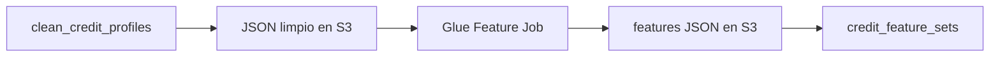

# Clase 5: AWS Glue para feature engineering crediticio

| | |
|---|---|
| **Clase** | 5 de 11 |
| **Duración** | 3 horas |
| **Controlador** | `Clase05Controller` |
| **Endpoints** | `POST /modulo1/clase05/credit-files/features`, `GET /modulo1/clase05/credit-files/:applicationId/features-status`, `GET /modulo1/clase05/credit-files/:applicationId/features` |

## Objetivos

Al terminar esta sesión podrás:

- Explicar qué es feature engineering en evaluación crediticia.
- Usar AWS Glue para generar variables derivadas.
- Crear un dataset de features para futuros modelos.
- Guardar las variables del file en Postgres/Supabase.
- Preparar el camino para entrenamiento con SageMaker.

---

## Parte teórica

### De perfil limpio a variables

Clase 4 produjo datos limpios:

```json
{
  "net_monthly_income": 8500,
  "monthly_debt_payment": 1800,
  "requested_amount": 450000,
  "property_value": 600000
}
```

Clase 5 crea señales para modelos:

```json
{
  "debt_to_income_ratio": 0.2118,
  "loan_to_value_ratio": 0.75,
  "payment_to_income_ratio": 0.3529,
  "credit_history_score": 80
}
```

### Variables del curso

| Variable | Qué representa |
|----------|----------------|
| `debt_to_income_ratio` | Cuánto de su ingreso ya está comprometido en deudas |
| `loan_to_value_ratio` | Relación entre monto solicitado y valor del inmueble |
| `payment_to_income_ratio` | Cuota estimada del crédito vs ingreso |
| `employment_stability_score` | Señal simple de estabilidad laboral |
| `banking_capacity_score` | Señal simple basada en saldo promedio |
| `credit_history_score` | Penalización por mora y deudas activas |

Estas reglas son sintéticas y explicables. No representan una política bancaria real.

### Por qué seguimos con Glue

Clase 4 usó Glue para limpiar. Clase 5 usa Glue para transformar datos limpios en variables.



---

## Parte práctica

### 1. Crea la migración

```bash
npx typeorm-ts-node-commonjs migration:create src/migrations/CreateCreditFeatureSets
```

Reemplaza el contenido, conservando el nombre generado:

```typescript
import { MigrationInterface, QueryRunner } from 'typeorm';

export class CreateCreditFeatureSets1780000000002
  implements MigrationInterface
{
  name = 'CreateCreditFeatureSets1780000000002';

  public async up(queryRunner: QueryRunner): Promise<void> {
    const schema = process.env.DATABASE_SCHEMA ?? 'public';
    const q = `"${schema}"`;

    await queryRunner.query(`
      CREATE TABLE ${q}."credit_feature_sets" (
        "id" uuid PRIMARY KEY DEFAULT gen_random_uuid(),
        "application_id" uuid NOT NULL UNIQUE,
        "debt_to_income_ratio" numeric(8,4),
        "loan_to_value_ratio" numeric(8,4),
        "payment_to_income_ratio" numeric(8,4),
        "employment_stability_score" numeric(8,2),
        "banking_capacity_score" numeric(8,2),
        "credit_history_score" numeric(8,2),
        "synthetic_risk_label" integer,
        "features_payload" jsonb NOT NULL DEFAULT '{}'::jsonb,
        "schema_payload" jsonb NOT NULL DEFAULT '{}'::jsonb,
        "created_at" timestamptz NOT NULL DEFAULT now(),
        "updated_at" timestamptz NOT NULL DEFAULT now(),
        CONSTRAINT "FK_credit_feature_sets_application"
          FOREIGN KEY ("application_id") REFERENCES ${q}."credit_applications"("id")
      )
    `);
  }

  public async down(queryRunner: QueryRunner): Promise<void> {
    const schema = process.env.DATABASE_SCHEMA ?? 'public';
    const q = `"${schema}"`;
    await queryRunner.query(`DROP TABLE IF EXISTS ${q}."credit_feature_sets"`);
  }
}
```

Ejecuta:

```bash
npm run migration:run
```

### 2. Crea la entidad

Archivo: `src/entities/credit-feature-set.entity.ts`

```typescript
import {
  Column,
  CreateDateColumn,
  Entity,
  PrimaryGeneratedColumn,
  UpdateDateColumn,
} from 'typeorm';

@Entity({ name: 'credit_feature_sets' })
export class CreditFeatureSet {
  @PrimaryGeneratedColumn('uuid')
  id: string;

  @Column({ name: 'application_id', type: 'uuid', unique: true })
  applicationId: string;

  @Column({ name: 'debt_to_income_ratio', type: 'numeric', nullable: true })
  debtToIncomeRatio?: number;

  @Column({ name: 'loan_to_value_ratio', type: 'numeric', nullable: true })
  loanToValueRatio?: number;

  @Column({ name: 'payment_to_income_ratio', type: 'numeric', nullable: true })
  paymentToIncomeRatio?: number;

  @Column({ name: 'employment_stability_score', type: 'numeric', nullable: true })
  employmentStabilityScore?: number;

  @Column({ name: 'banking_capacity_score', type: 'numeric', nullable: true })
  bankingCapacityScore?: number;

  @Column({ name: 'credit_history_score', type: 'numeric', nullable: true })
  creditHistoryScore?: number;

  @Column({ name: 'synthetic_risk_label', type: 'integer', nullable: true })
  syntheticRiskLabel?: number;

  @Column({ name: 'features_payload', type: 'jsonb', default: {} })
  featuresPayload: Record<string, unknown>;

  @Column({ name: 'schema_payload', type: 'jsonb', default: {} })
  schemaPayload: Record<string, unknown>;

  @CreateDateColumn({ name: 'created_at', type: 'timestamptz' })
  createdAt: Date;

  @UpdateDateColumn({ name: 'updated_at', type: 'timestamptz' })
  updatedAt: Date;
}
```

### 3. Variables de entorno

Agrega:

```env
AWS_GLUE_FEATURES_JOB_NAME=features-mortgage-credit-file
AWS_S3_FEATURES_PREFIX=features/credit-files
```

### 4. Script Glue de features

En Glue crea un job Spark o Python Shell llamado `features-mortgage-credit-file`. Para laboratorio puedes usar Python Shell:

```python
import json
import sys
import boto3
from awsglue.utils import getResolvedOptions

args = getResolvedOptions(
    sys.argv,
    ["BUCKET", "APPLICATION_ID", "INPUT_KEY", "OUTPUT_KEY"],
)

s3 = boto3.client("s3")

def read_json(bucket, key):
    obj = s3.get_object(Bucket=bucket, Key=key)
    return json.loads(obj["Body"].read().decode("utf-8"))

def write_json(bucket, key, data):
    s3.put_object(
        Bucket=bucket,
        Key=key,
        Body=json.dumps(data, ensure_ascii=False, indent=2).encode("utf-8"),
        ContentType="application/json",
    )

def safe_divide(a, b):
    if a is None or b in (None, 0):
        return None
    return round(float(a) / float(b), 4)

def score_employment(months):
    if months is None:
        return 40
    if months >= 60:
        return 100
    if months >= 24:
        return 80
    if months >= 12:
        return 60
    return 35

def score_banking(balance, income):
    if balance is None or income in (None, 0):
        return 40
    ratio = float(balance) / float(income)
    if ratio >= 3:
        return 100
    if ratio >= 1:
        return 75
    if ratio >= 0.3:
        return 55
    return 30

def score_history(has_late_payments, active_loan_count):
    score = 100
    if has_late_payments:
        score -= 35
    score -= min(int(active_loan_count or 0) * 8, 40)
    return max(score, 0)

payload = read_json(args["BUCKET"], args["INPUT_KEY"])
clean = payload.get("clean", payload)

income = clean.get("net_monthly_income")
monthly_debt = clean.get("monthly_debt_payment")
requested_amount = clean.get("requested_amount")
property_value = clean.get("property_value")
estimated_payment = clean.get("estimated_monthly_payment")
employment_months = clean.get("employment_tenure_months")
avg_balance = clean.get("average_monthly_balance")
has_late = clean.get("has_late_payments")
active_loans = clean.get("active_loan_count")

features = {
    "application_id": args["APPLICATION_ID"],
    "net_monthly_income": income,
    "monthly_debt_payment": monthly_debt,
    "property_value": property_value,
    "requested_amount": requested_amount,
    "requested_term_months": clean.get("requested_term_months"),
    "estimated_monthly_payment": estimated_payment,
    "debt_to_income_ratio": safe_divide(monthly_debt, income),
    "loan_to_value_ratio": safe_divide(requested_amount, property_value),
    "payment_to_income_ratio": safe_divide(estimated_payment, income),
    "employment_stability_score": score_employment(employment_months),
    "banking_capacity_score": score_banking(avg_balance, income),
    "credit_history_score": score_history(has_late, active_loans),
}

risk_points = 0
if (features["debt_to_income_ratio"] or 0) > 0.45:
    risk_points += 1
if (features["loan_to_value_ratio"] or 0) > 0.85:
    risk_points += 1
if features["credit_history_score"] < 60:
    risk_points += 1
if features["employment_stability_score"] < 60:
    risk_points += 1

features["synthetic_risk_label"] = 1 if risk_points >= 2 else 0

schema = {
    "numeric": [
        "debt_to_income_ratio",
        "loan_to_value_ratio",
        "payment_to_income_ratio",
        "employment_stability_score",
        "banking_capacity_score",
        "credit_history_score",
    ],
    "target_for_later_training": "synthetic_risk_label",
}

write_json(args["BUCKET"], args["OUTPUT_KEY"], {
    "features": features,
    "schema": schema,
})
```

### 5. Extiende `GlueService`

Archivo: `src/modulo1/clase04/glue.service.ts`

Añade este método:

```typescript
  async startFeaturesJob(args: {
    applicationId: string;
    inputKey: string;
    outputKey: string;
  }) {
    const jobName = this.config.getOrThrow<string>('AWS_GLUE_FEATURES_JOB_NAME');

    const command = new StartJobRunCommand({
      JobName: jobName,
      Arguments: {
        '--BUCKET': this.config.getOrThrow<string>('AWS_S3_BUCKET'),
        '--APPLICATION_ID': args.applicationId,
        '--INPUT_KEY': args.inputKey,
        '--OUTPUT_KEY': args.outputKey,
      },
    });

    const response = await this.client.send(command);
    return {
      jobName,
      jobRunId: response.JobRunId!,
    };
  }
```

### 6. Crea `Clase05Service`

Archivo: `src/modulo1/clase05/clase05.service.ts`

```typescript
import { BadRequestException, Injectable, NotFoundException } from '@nestjs/common';
import { ConfigService } from '@nestjs/config';
import { GetObjectCommand, S3Client } from '@aws-sdk/client-s3';
import { InjectRepository } from '@nestjs/typeorm';
import { Repository } from 'typeorm';
import { CleanCreditProfile } from '../../entities/clean-credit-profile.entity';
import { CreditFeatureSet } from '../../entities/credit-feature-set.entity';
import { GlueJobRunEntity } from '../../entities/glue-job-run.entity';
import { GlueService } from '../clase04/glue.service';

@Injectable()
export class Clase05Service {
  private readonly s3: S3Client;

  constructor(
    private readonly config: ConfigService,
    private readonly glue: GlueService,
    @InjectRepository(CleanCreditProfile)
    private readonly cleanProfiles: Repository<CleanCreditProfile>,
    @InjectRepository(CreditFeatureSet)
    private readonly featureSets: Repository<CreditFeatureSet>,
    @InjectRepository(GlueJobRunEntity)
    private readonly glueRuns: Repository<GlueJobRunEntity>,
  ) {
    this.s3 = new S3Client({
      region: this.config.getOrThrow<string>('AWS_REGION'),
    });
  }

  async generateFeatures(body: { applicationId: string }) {
    const profile = await this.cleanProfiles.findOne({
      where: { applicationId: body.applicationId },
    });

    if (!profile) {
      throw new BadRequestException('Run Clase 4 before generating features');
    }

    const cleanPrefix = this.config.getOrThrow<string>('AWS_S3_CLEAN_PREFIX');
    const featuresPrefix = this.config.getOrThrow<string>('AWS_S3_FEATURES_PREFIX');
    const inputKey = `${cleanPrefix}/${body.applicationId}/clean-profile.json`;
    const outputKey = `${featuresPrefix}/${body.applicationId}/features.json`;

    const job = await this.glue.startFeaturesJob({
      applicationId: body.applicationId,
      inputKey,
      outputKey,
    });

    const run = await this.glueRuns.save(
      this.glueRuns.create({
        applicationId: body.applicationId,
        jobName: job.jobName,
        jobRunId: job.jobRunId,
        jobType: 'FEATURE_ENGINEERING',
        status: 'STARTING',
        inputPath: inputKey,
        outputPath: outputKey,
      }),
    );

    return {
      applicationId: body.applicationId,
      jobRunId: run.jobRunId,
      status: run.status,
      outputKey,
    };
  }

  async getFeaturesStatus(applicationId: string) {
    const run = await this.glueRuns.findOne({
      where: { applicationId, jobType: 'FEATURE_ENGINEERING' },
      order: { createdAt: 'DESC' },
    });

    if (!run) {
      throw new NotFoundException('No features job found for this application');
    }

    const status = await this.glue.getJobStatus(run.jobName, run.jobRunId);
    await this.glueRuns.update(run.id, { status });

    if (status === 'SUCCEEDED') {
      await this.importFeatures(applicationId, run.outputPath!);
    }

    return {
      applicationId,
      jobRunId: run.jobRunId,
      status,
    };
  }

  async getFeatures(applicationId: string) {
    const features = await this.featureSets.findOne({ where: { applicationId } });
    if (!features) {
      throw new NotFoundException('Features not found for this application');
    }
    return features;
  }

  private async importFeatures(applicationId: string, key: string) {
    const response = await this.s3.send(
      new GetObjectCommand({
        Bucket: this.config.getOrThrow<string>('AWS_S3_BUCKET'),
        Key: key,
      }),
    );

    const payload = JSON.parse(await response.Body!.transformToString());
    const features = payload.features;
    const existing = await this.featureSets.findOne({ where: { applicationId } });

    await this.featureSets.save(
      this.featureSets.create({
        ...(existing ?? {}),
        applicationId,
        debtToIncomeRatio: features.debt_to_income_ratio,
        loanToValueRatio: features.loan_to_value_ratio,
        paymentToIncomeRatio: features.payment_to_income_ratio,
        employmentStabilityScore: features.employment_stability_score,
        bankingCapacityScore: features.banking_capacity_score,
        creditHistoryScore: features.credit_history_score,
        syntheticRiskLabel: features.synthetic_risk_label,
        featuresPayload: features,
        schemaPayload: payload.schema,
      }),
    );
  }
}
```

### 7. Crea el controller

Archivo: `src/modulo1/clase05/clase05.controller.ts`

```typescript
import { Body, Controller, Get, Param, Post, UseGuards } from '@nestjs/common';
import { ApiKeyGuard } from '../../auth/guards/api-key.guard';
import { Clase05Service } from './clase05.service';

@Controller('modulo1/clase05')
@UseGuards(ApiKeyGuard)
export class Clase05Controller {
  constructor(private readonly clase05: Clase05Service) {}

  @Post('credit-files/features')
  async generateFeatures(@Body() body: { applicationId: string }) {
    return await this.clase05.generateFeatures(body);
  }

  @Get('credit-files/:applicationId/features-status')
  async getFeaturesStatus(@Param('applicationId') applicationId: string) {
    return await this.clase05.getFeaturesStatus(applicationId);
  }

  @Get('credit-files/:applicationId/features')
  async getFeatures(@Param('applicationId') applicationId: string) {
    return await this.clase05.getFeatures(applicationId);
  }
}
```

### 8. Actualiza `Modulo1Module`

Agrega:

```typescript
import { CreditFeatureSet } from '../entities/credit-feature-set.entity';
import { Clase05Controller } from './clase05/clase05.controller';
import { Clase05Service } from './clase05/clase05.service';
```

Incluye `CreditFeatureSet` en `TypeOrmModule.forFeature([...])`, `Clase05Controller` en `controllers` y `Clase05Service` en `providers`.

Mantén también `GlueService`, `GlueJobRunEntity` y `CleanCreditProfile`, porque Clase 5 reutiliza el patrón de Glue creado en Clase 4.

### 9. Prueba

```bash
curl -X POST http://localhost:3000/modulo1/clase05/credit-files/features \
  -H "Content-Type: application/json" \
  -H "x-api-key: test1" \
  -H "x-api-secret: pass1" \
  -d '{ "applicationId": "APPLICATION_ID" }'
```

Consulta estado:

```bash
curl http://localhost:3000/modulo1/clase05/credit-files/APPLICATION_ID/features-status \
  -H "x-api-key: test1" \
  -H "x-api-secret: pass1"
```

Consulta features:

```bash
curl http://localhost:3000/modulo1/clase05/credit-files/APPLICATION_ID/features \
  -H "x-api-key: test1" \
  -H "x-api-secret: pass1"
```

### 10. Entrega

- Captura del job de features `SUCCEEDED`.
- Evidencia de registro en `credit_feature_sets`.
- Explica las variables `debt_to_income_ratio`, `loan_to_value_ratio` y `credit_history_score`.
- Explica por qué `synthetic_risk_label` no representa una política bancaria real.

## Recursos

- [AWS Glue](https://docs.aws.amazon.com/glue/latest/dg/what-is-glue.html)
- [Glue Python Shell jobs](https://docs.aws.amazon.com/glue/latest/dg/aws-glue-programming-python.html)
- [Feature engineering](https://docs.aws.amazon.com/sagemaker/latest/dg/feature-store.html)
- [Machine learning terminology](https://developers.google.com/machine-learning/glossary)
